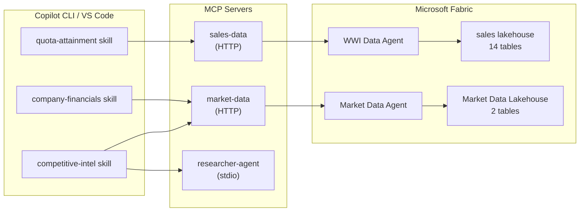

# Data Paths

The Fabric Sales Agent Accelerator supports **two parallel data paths** — each backed by a separate Fabric Data Agent and Lakehouse. Both paths use the same technology stack; only the data and use cases differ.

## Architecture Overview



## Path Comparison

| | **WWI Sales Data** | **Market Data** |
|---|---|---|
| **Source** | Microsoft Fabric tutorial sample data | SEC EDGAR Financial Statement Data Sets |
| **License** | Microsoft sample (MIT) | US government (public domain) |
| **Companies** | 1 fictional (sales) | ~50 real US public companies |
| **Tables** | 14 (facts + dimensions) | 2 (`company_financials`, `companies`) |
| **Metrics** | Sales, orders, purchases, stock | Revenue, net income, total assets |
| **Time range** | FY2013–FY2016 (static) | Recent SEC quarterly filings |
| **Use cases** | Internal sales ops, quota tracking | Market research, competitive intel |
| **MCP server** | `sales-data` | `market-data` |
| **Skills** | quota-attainment, quota-forecast, pipeline-query, pipeline-coverage, account-plan | company-financials, market-overview, competitive-intel |
| **Foundry tool** | `sales_data` | `real_world_market_data` |

## WWI Sales Data Path (Default)

The original demo dataset. Simulates an internal sales data warehouse for a wholesale novelty goods company.

### Key Tables

- `fact_Sale` — invoiced sales transactions
- `fact_Order` — purchase orders
- `dimension_Customer` — customer profiles
- `dimension_Stock_Item` — product catalog
- `quota_Target` — salesperson quota targets

### Example Queries

```
What are the top 10 customers by revenue for FY2016?
Show quarterly sales trend for Tailspin Toys.
Which salesperson exceeded their annual quota?
```

### Setup

```bash
make load-data                    # Downloads WWI Parquet files
# Then: upload to Fabric Lakehouse, create Data Agent, enable MCP
```

## Market Data Path (Optional)

Real-world financial data from SEC EDGAR. Enables genuine market research and competitive intelligence.

### Key Tables

**`company_financials`** — Normalized quarterly data from 10-K/10-Q filings:
| Column | Description |
|--------|-------------|
| `cik` | SEC Central Index Key (unique company ID) |
| `ticker` | Stock symbol (MSFT, AAPL, etc.) |
| `company_name` | Common company name |
| `revenue` | Total revenue in USD |
| `net_income` | Net income (profit/loss) in USD |
| `total_assets` | Balance sheet total assets in USD |
| `form` | 10-K (annual) or 10-Q (quarterly) |
| `fiscal_year` / `fiscal_period` | Filing period |

**`companies`** — Company profiles with SIC industry codes.

### Example Queries

```
What was Microsoft's revenue for the most recent fiscal year?
Compare NVIDIA and AMD revenue and margins.
Which Software & Services companies had the highest revenue growth?
Show Apple's quarterly revenue trend for the last 4 quarters.
```

### Setup

```bash
make load-market-data             # Downloads and normalizes SEC EDGAR data
# Then: upload to a new Fabric Lakehouse, create Data Agent, enable MCP
```

See [Setup Guide](setup-guide.md) for step-by-step instructions.

## Combining Both Paths

When both data paths are configured, the agent can cross-reference internal sales performance with public market data:

```
How does our sales growth compare to the industry average?
Build a competitive intel brief for our top customer's industry.
What's NVIDIA's revenue trend, and how does our hardware accessory
pipeline align with semiconductor industry growth?
```

### Foundry Configuration

Set both environment variables:

```env
FABRIC_IQ_CONNECTION_ID=<your-wwi-connection-id>
MARKET_DATA_CONNECTION_ID=<your-market-connection-id>
```

The orchestrator registers both tools automatically and generates dynamic instructions that cover both data sources.

## Extending the Data

### Adding More Companies

The curated company list lives in the `CURATED` table near the top of
`scripts/load_sec_edgar.py` (one `(ticker, industry)` pair per company). Add tickers
there, then re-run the loader:

```bash
python scripts/load_sec_edgar.py --user-agent "Your Name you@example.com"
```

The loader resolves each ticker to its SEC CIK automatically and pulls the full
available history (annual 10-K and quarterly 10-Q periods) in a single run, so there
is no per-quarter step to repeat.

### People Data Labs (Advanced)

[People Data Labs](https://www.peopledatalabs.com/) offers 22M+ company profiles (funding, headcount, tech stack) under CC BY 4.0. This is an excellent complement to SEC financials for non-public companies. Requires registration and an API key — see their docs for details.

### Live Web Research

The `researcher-agent` already supports live web search via Bing or Tavily. Set:

```env
SEARCH_PROVIDER=bing    # or tavily
SEARCH_API_KEY=<your-key>
```

The `competitive-intel` skill combines SEC financials with live web research for real-time competitive intelligence.
