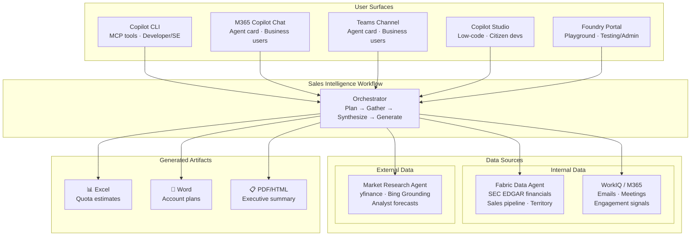

# Architecture

## Surfaces

| Surface | Audience | Topology | Repo |
|---------|----------|----------|------|
| **Copilot CLI** | Developers, SEs | 1 agent + MCP tools | `agent-demo-dev` |
| **M365 Copilot Chat** | Business users | Foundry agent → FabricIQ + WorkIQ | `agent-demo-dev` |
| **Teams** | Business users | Same Foundry agent, Teams channel | `agent-demo-dev` |
| **Copilot Studio** | Citizen devs | Low-code topics + connectors | Studio designer |
| **Foundry Portal** | Testing / admin | Playground chat UI | `agent-demo-dev` |

## Data Sources

| Source | What | Location |
|--------|------|----------|
| **Fabric Data Agent** | SEC EDGAR financials (~50 companies), sales pipeline, territory | OneLake Lakehouse |
| **Market Research Agent** | yfinance real-time data, Bing Grounding (news, forecasts) | `ericchansen/market-research` (separate deploy) |
| **WorkIQ / M365** | Emails, meetings, engagement signals | M365 Graph (mocked in demo) |

## Key Insight

The **workflow** is constant: gather internal data → gather external research → pull activity context → synthesize → generate artifacts.

The **surface** determines the deployment topology:
- CLI = one process with tool calls
- Foundry/M365/Teams = hosted agent with platform tools
- Copilot Studio = visual topic flows calling the same backends

"Multi-agent" isn't an architecture choice — it's a description of the workflow complexity.
