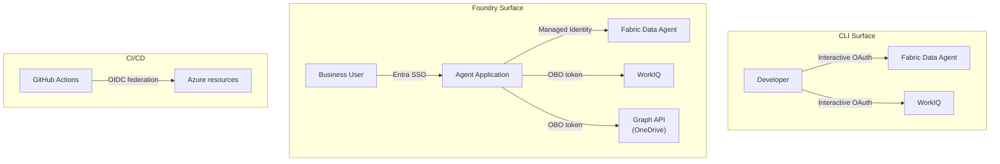

# Authentication Patterns

This accelerator uses different auth patterns depending on the surface and what's being accessed. Understanding these is important for both setup and security.

## Auth by surface

## Summary table

| Context | Auth method | What it accesses | Who it acts as |
|---|---|---|---|
| CLI → Fabric | Interactive OAuth | Lakehouse data | You (developer) |
| CLI → WorkIQ | Interactive OAuth | M365 activity | You (developer) |
| Foundry → Fabric | Managed identity | Lakehouse data | The agent (service) |
| Foundry → WorkIQ | OBO (on-behalf-of) | M365 activity | The signed-in user |
| Foundry → OneDrive | OBO | File upload | The signed-in user |
| CI → Azure | OIDC workload identity | Infra deployment | GitHub Actions runner |

## Key concepts

### Interactive OAuth (CLI)
When you run Copilot CLI and it calls an MCP server that needs authentication, you get a browser prompt. You sign in once, and the token is cached for subsequent calls. Simple, but only works for human-in-the-loop scenarios.

### On-behalf-of / OBO (Foundry)
The Foundry agent acts *as* the signed-in user. When a business user asks the agent about their M365 activity, the agent uses an OBO token to call Graph API with that user's permissions. The agent can only see what the user can see.

> 📖 [OBO flow](https://learn.microsoft.com/entra/identity-platform/v2-oauth2-on-behalf-of-flow)

### Managed identity (Foundry → Fabric)
For shared data (Lakehouse tables), the agent uses its own managed identity — not the user's token. This is appropriate because the sales data is workspace-scoped, not user-scoped.

> 📖 [Managed identities](https://learn.microsoft.com/entra/identity/managed-identities-azure-resources/overview)

### OIDC workload identity (CI/CD)
GitHub Actions authenticates to Azure using OIDC federation — no stored secrets. The workflow requests a short-lived token from Entra ID using the GitHub-issued JWT.

> 📖 [Workload identity federation](https://learn.microsoft.com/entra/workload-id/workload-identity-federation) · [GitHub OIDC with Azure](https://docs.github.com/actions/security-for-github-actions/security-hardening-your-deployments/configuring-openid-connect-in-azure)

## Security boundaries

- **User data (WorkIQ, OneDrive)** → always OBO, always user-scoped
- **Shared data (Lakehouse)** → service identity, workspace RBAC
- **Infrastructure** → OIDC, no stored secrets
- **Demo tenant** → mock M365 data, no real PII

## Further reading

- [Entra identity platform](https://learn.microsoft.com/entra/identity-platform/)
- [Fabric workspace security](https://learn.microsoft.com/fabric/security/permission-model)
- [Microsoft Graph permissions](https://learn.microsoft.com/graph/permissions-overview)
- [Azure RBAC](https://learn.microsoft.com/azure/role-based-access-control/overview)
