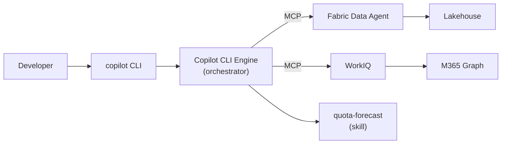

# CLI Surface Architecture

The CLI surface uses GitHub Copilot CLI as the agent runtime. It's the prototyping environment — zero infrastructure, instant feedback, and direct access to MCP servers.

## Architecture

## How it works

1. You run `copilot` in the project directory
2. Copilot CLI reads `.github/mcp.json` and discovers available MCP servers
3. It also discovers skills from `src/cli/skills/` or `.github/copilot/skills/`
4. When you ask a question, the engine matches your intent to available tools
5. Tool calls are made, results are combined, and the response is displayed inline

## Key characteristics

| Aspect | Detail |
|---|---|
| **Orchestrator** | Copilot CLI engine (built-in, no custom code) |
| **Tool protocol** | MCP (HTTP and stdio transports) |
| **Auth** | Interactive OAuth (browser prompt on first use) |
| **Output** | Inline markdown in terminal |
| **Infrastructure** | None — runs locally |
| **Iteration speed** | Instant — edit MCP config or skills, re-run |

## Configuration files

| File | Purpose |
|---|---|
| `.github/mcp.json` | MCP server registry (auto-discovered) |
| `src/cli/skills/` | Skill prompt templates |
| `src/cli/mcp-config.json` | Alternative MCP config location |

## When to use the CLI surface

- **Prototyping** — testing new MCP servers, skills, or data sources
- **Development** — building and debugging tool integrations
- **SE demos** — showing the agent to technical audiences
- **Individual use** — personal productivity with connected tools

> 📖 [GitHub Copilot CLI](https://docs.github.com/copilot/github-copilot-in-the-cli) · [MCP in Copilot CLI](https://docs.github.com/copilot/github-copilot-in-the-cli/using-mcp-servers-with-copilot-cli)
