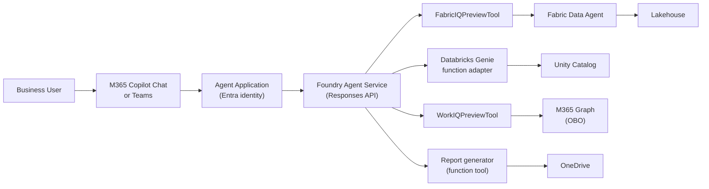
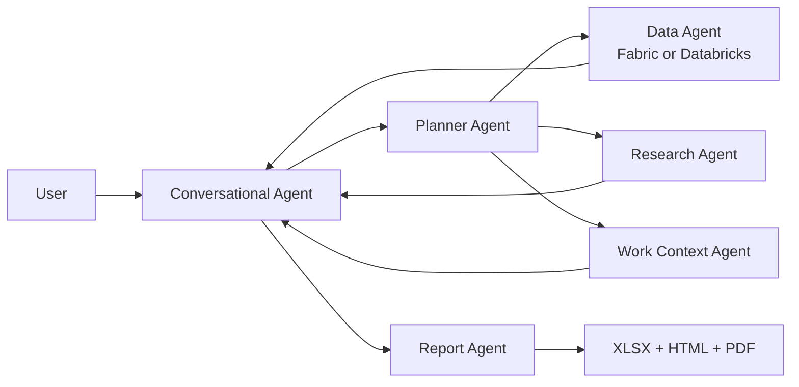

# Foundry Surface Architecture

:::info Where you are · 🗓️ Day 2
The Foundry surface is where **Day 2** begins: you take the same agent workflow from Day 1
and ship it as a registered Azure AI Foundry agent, test it in the Playground, then publish
to M365 Copilot and Teams. See the [Workshop Overview](../intro) for the full path.
:::

The Foundry surface publishes the agent as an Azure AI Foundry Agent Application, accessible through M365 Copilot Chat and Teams. This is the production deployment path for business users.

## Architecture



## How it works

1. User @mentions the agent in M365 Copilot Chat or Teams
2. The Agent Application routes the request to the Foundry Agent Service
3. The Responses API matches intent to registered tools
4. Platform tools (FabricIQ, WorkIQ) handle data access with built-in auth
5. Custom function tools (report generator) execute business logic
6. Response is returned to the user with adaptive card formatting

## Project and portal experience

There are **two kinds of Foundry project** and they are easy to confuse:

| Kind | Resource | Endpoint shape | Used by |
|---|---|---|---|
| **Hub-based** | `Microsoft.MachineLearningServices/workspaces` (`kind: 'Project'`) | `azureml://…` | classic hub/CLI workflows |
| **Account-based** (Foundry Agent Service) | `Microsoft.CognitiveServices/accounts/projects` | `https://<account>.services.ai.azure.com/api/projects/<project>` | the `azure-ai-projects` SDK + Responses API used by `src/orchestrator/foundry_agent.py` |

The agent SDK in this repo (`azure-ai-projects>=2.2.0`, `PromptAgentDefinition`, the Responses API)
talks to an **account-based** project. `FOUNDRY_PROJECT_ENDPOINT` must therefore be the
`…services.ai.azure.com/api/projects/…` URL, not the hub workspace.

The dev hub (`fabric-agent-hub-dev`) and its hub-based project (`fsa-project-dev`) are still provisioned
by Bicep (`infra/modules/foundry-project.bicep`) for the classic surface, but agent registration runs
against an account-based project.

### Provision the account-based project and a model

```powershell
# 1. Enable project management on the AI Services account (one-time).
$acct = az cognitiveservices account show -g rg-fabric-agent-dev -n fabricagentaidev2026 --query id -o tsv
az resource update --ids $acct --set properties.allowProjectManagement=true --latest-include-preview

# 2. Create the account-based Foundry project.
az cognitiveservices account project create -g rg-fabric-agent-dev --name fabricagentaidev2026 --project-name fsa-foundry-project-dev --location eastus2

# 3. Deploy a chat model (matches MODEL_DEPLOYMENT_NAME).
az cognitiveservices account deployment create -g rg-fabric-agent-dev -n fabricagentaidev2026 --deployment-name gpt-4o --model-name gpt-4o --model-version 2024-11-20 --model-format OpenAI --sku-name GlobalStandard --sku-capacity 10
```

### Configure the environment

Set these (e.g. in a `.env` file at the repo root):

```dotenv
FOUNDRY_PROJECT_ENDPOINT=https://fabricagentaidev2026.services.ai.azure.com/api/projects/fsa-foundry-project-dev
MODEL_DEPLOYMENT_NAME=gpt-4o
# Optional — when omitted the agent uses a demo-safe fabric_query fallback so you
# can run live on day one before wiring real data.
# FABRIC_IQ_CONNECTION_ID=<fabric data agent connection id>
```

### Register the agent before you look for it in the portal

The portal only shows an agent **after** you register it from code. Agents are not created by the
infra deploy — they are created by the SDK path in `src/orchestrator/foundry_agent.py`. Register the
WWI single agent (and run a query) with either of:

```powershell
uv run python -m src.orchestrator "Compute quota attainment: target 1,000,000, ytd 600,000, pipeline 500,000, 6 months, 180 days"
# Or the reproducible end-to-end check (register -> list -> Playground query):
uv run python scripts/verify_foundry_agent.py
```

`verify_foundry_agent.py` is the canonical proof: it registers or reuses the fingerprinted `WWISalesAgent`
definition, lists the project agents to confirm portal visibility, and runs one Responses-API query (the same
call the Playground makes). The check intentionally clears preview platform-tool connection ids for this
single smoke query so it uses the deterministic local `fabric_query` / `get_account_activity` function tools.
A successful run prints `[OK] live registration + Playground response verified`.

Once it has run successfully at least once, open the Foundry portal (`https://ai.azure.com`):

1. Open the **fsa-foundry-project-dev** project.
2. Open **Agents**. You should now see the `WWISalesAgent` registration. (If the list is empty, the
   registration step above has not completed — re-run it and check the CLI output for errors.)
3. Open the agent in **Playground** and run `Generate a quota report for Tailspin Toys`.
4. Open tracing or observability views and inspect the tool calls, latency, and generated artifact metadata.
5. Use **Publish** when the agent is ready for Microsoft 365 Copilot and Teams.


Use this visual as the Day 2 checkpoint: the left pane confirms `WWISalesAgent` exists, the Playground prompt
proves the Responses API path works, and the trace pane confirms tool-call observability without logging payloads.

> **Fabric IQ vs. the demo fallback.** The `FabricIQPreviewTool` is a *platform* tool that requires a
> real Fabric Data Agent connection **and** a project/region where the preview tool is enabled on the
> Responses API. When `FABRIC_IQ_CONNECTION_ID` is unset, the agent instead registers a `fabric_query`
> function tool backed by demo-safe WWI rows, so registration and the Playground response work in any
> account-based project. Swap in the real connection id to query live data.

## Multi-agent pipeline alternative

The single-agent path is simplest: one Foundry agent has Fabric/Databricks, WorkIQ, research, and report tools.
The advanced path decomposes the same business outcome:



Use the multi-agent pattern when you need independent observability, separate ownership, or agent-specific
evaluation. Use the single-agent pattern when speed, fewer registrations, and simpler publishing matter more.

> **Scope honesty.** The multi-agent pipeline shipped in this repo is a **local, deterministic proof of
> concept** (`src/orchestrator/multi_agent/`). It runs the planner → data → research → context → report
> stages in-process to mirror the single-agent output, so you can demo and unit-test the decomposition
> without provisioning six Foundry agents. It is **not** live Foundry agent-to-agent chaining yet: the
> stage names map to the `foundry_agent_name` slots that *would* be registered, but no inter-agent
> Foundry calls are made. Promote it to live chaining only after registering each stage as its own
> Foundry agent and validating SDK support — then add portal traces here. The working PoC is invocable with:

```powershell
uv run python -m src.orchestrator.multi_agent "Generate a quota report for Tailspin Toys" --customer "Tailspin Toys" --data-source fabric
uv run python -m src.orchestrator.multi_agent "Generate a quota report for Tailspin Toys" --customer "Tailspin Toys" --data-source databricks
```

## Key characteristics

| Aspect | Detail |
|---|---|
| **Orchestrator** | Foundry Responses API |
| **Tool protocol** | Foundry tool registration (platform + function tools) |
| **Auth** | OBO (on-behalf-of) via Entra |
| **Output** | Adaptive cards, DOCX links, rich formatting |
| **Infrastructure** | Azure AI Foundry (managed) |
| **Distribution** | M365 Copilot Chat, Teams, direct API |

## Components

| Component | Location | Purpose |
|---|---|---|
| Agent orchestrator | `src/orchestrator/` | Foundry agent configuration and tool wiring |
| Hosted agent runtime | `src/orchestrator/hosted_agent/` | Bring-your-own-code container with Fabric MCP, quota, research, attainment, activity, and report tools |
| Report generator | `src/agents/report_generator/` | DOCX generation + OneDrive upload |
| Infra (Bicep) | `infra/` | Foundry hub + project (`kind: 'Project'`), storage, Key Vault, Fabric capacity. Agents and Entra app are registered out-of-band (SDK / CLI). |

## Hosted runtime configuration

Set these environment variables on the hosted container:

| Variable | Purpose |
|---|---|
| `FABRIC_MCP_URL` | Fabric Data Agent MCP endpoint |
| `FABRIC_MCP_TOOL_NAME` | MCP tool name to invoke for natural-language Fabric questions |
| `MODEL_ENDPOINT` | Optional endpoint for an injected Copilot SDK-compatible chat adapter |
| `MODEL_DEPLOYMENT` | Model deployment name, defaulting to `gpt-4o` |
| `HOSTED_AGENT_OUTPUT_DIR` | Output directory for generated quota artifacts |
| `COPILOT_HOME` | Optional credential/cache path if your Copilot SDK adapter requires it |

## When to use the Foundry surface

- **Business users** — people who work in Teams and Outlook, not terminals
- **Enterprise distribution** — Entra identity, RBAC, compliance
- **Rich output** — DOCX reports, adaptive cards, OneDrive links
- **Production** — monitored, scalable, auditable

> 📖 [Microsoft Foundry Agent Service](https://learn.microsoft.com/en-us/azure/foundry/agents/overview) · [Publish agents to Microsoft 365 Copilot and Teams](https://learn.microsoft.com/en-us/azure/foundry/agents/how-to/publish-copilot) · [Tracing for AI agents](https://learn.microsoft.com/en-us/azure/foundry/observability/how-to/trace-agent-setup)
