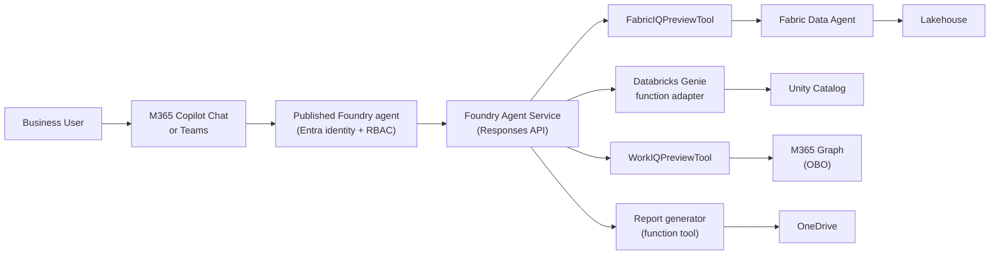
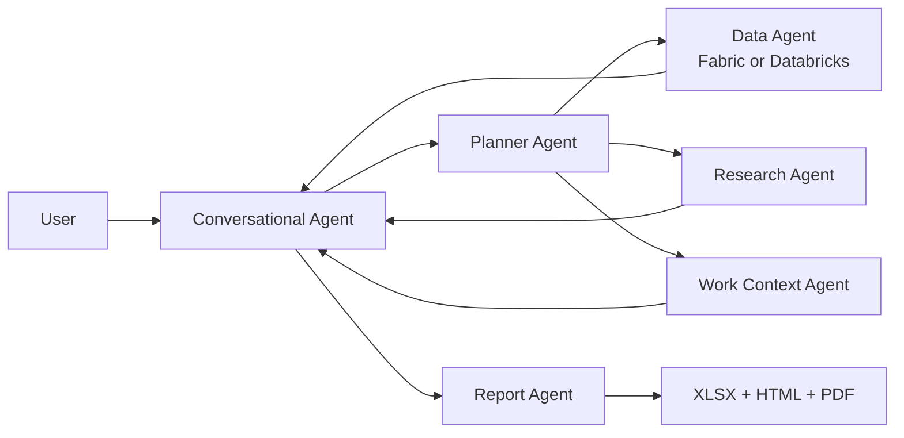

# Foundry Surface Architecture

:::info[Where you are · 🗓️ Day 2]

The Foundry surface is where **Day 2** begins: you take the same agent workflow from Day 1
and ship it as a registered Azure AI Foundry agent, test it in the Playground, then publish
to M365 Copilot and Teams. See the [Workshop Overview](../intro) for the full path.
:::

The Foundry surface registers the agent in Azure AI Foundry, then publishes that agent to M365 Copilot Chat and Teams. This is the production deployment path for business users.

## Architecture



## How it works

1. User @mentions the agent in M365 Copilot Chat or Teams
2. The published Foundry agent routes the request to the Foundry Agent Service
3. The Responses API matches intent to registered tools
4. Platform tools (FabricIQ, WorkIQ) handle data access with built-in auth
5. Custom function tools (report generator) execute business logic
6. Response is returned to the user with adaptive card formatting

## Project and portal experience

This repo uses the **modern (account-based)** Foundry architecture exclusively:

| Kind | Resource | Endpoint shape | Used by |
|---|---|---|---|
| **Account-based** (Foundry Agent Service) | `Microsoft.CognitiveServices/accounts/projects` | `https://<account>.services.ai.azure.com/api/projects/<project>` | the `azure-ai-projects` SDK + Responses API used by `src/orchestrator/foundry_agent.py` |

The agent SDK in this repo (`azure-ai-projects>=2.2.0`, `PromptAgentDefinition`, the Responses API)
talks to an **account-based** project. `FOUNDRY_PROJECT_ENDPOINT` must therefore be the
`…services.ai.azure.com/api/projects/…` URL.

The Bicep IaC (`infra/main.bicep`) provisions the AI Services account; the child project is created
via SDK or the Azure portal (not Bicep), because the account-based project model is provisioned
as a child resource of the CognitiveServices account.

### Provision the account-based project and a model

```powershell
# 1. Enable project management on the AI Services account (one-time).
$env:AZURE_RESOURCE_GROUP="<your-resource-group>"
$env:AI_SERVICES_ACCOUNT_NAME="<your-ai-services-account>"
$env:FOUNDRY_PROJECT_NAME="<your-foundry-project>"
$env:MODEL_DEPLOYMENT_NAME="gpt-4o"

$acct = az cognitiveservices account show -g $env:AZURE_RESOURCE_GROUP -n $env:AI_SERVICES_ACCOUNT_NAME --query id -o tsv
az resource update --ids $acct --set properties.allowProjectManagement=true --latest-include-preview

# 2. Create the account-based Foundry project.
az cognitiveservices account project create -g $env:AZURE_RESOURCE_GROUP --name $env:AI_SERVICES_ACCOUNT_NAME --project-name $env:FOUNDRY_PROJECT_NAME --location eastus2

# 3. Deploy a chat model (matches MODEL_DEPLOYMENT_NAME).
az cognitiveservices account deployment create -g $env:AZURE_RESOURCE_GROUP -n $env:AI_SERVICES_ACCOUNT_NAME --deployment-name $env:MODEL_DEPLOYMENT_NAME --model-name gpt-4o --model-version 2024-11-20 --model-format OpenAI --sku-name GlobalStandard --sku-capacity 10
```

### Configure the environment

Set these (e.g. in a `.env` file at the repo root):

```dotenv
FOUNDRY_PROJECT_ENDPOINT=https://<ai-services-account>.services.ai.azure.com/api/projects/<project-name>
MODEL_DEPLOYMENT_NAME=gpt-4o
# Optional — when omitted the agent uses a demo-safe fabric_query fallback so you
# can run live on day one before wiring real data.
# FABRIC_IQ_CONNECTION_ID=<fabric data agent connection id>
```

### Register the agent before you look for it in the portal

The portal only shows an agent **after** you register it from code. Agents are not created by the
infra deploy — they are created by the SDK path in `src/orchestrator/foundry_agent.py`. Register the
WWI single agent (and run a query) with either of:

```powershell
uv run python -m src.orchestrator "Compute quota attainment: target 1,000,000, ytd 600,000, pipeline 500,000, 6 months, 180 days"
# Or the reproducible end-to-end check (register -> list -> Playground query):
uv run python scripts/verify_foundry_agent.py
```

`verify_foundry_agent.py` is the canonical proof: it registers or reuses the fingerprinted `WWISalesAgent`
definition, lists the project agents to confirm portal visibility, and runs one Responses-API query (the same
call the Playground makes). The check intentionally clears preview platform-tool connection ids for this
single smoke query so it uses the deterministic local `fabric_query` / `get_account_activity` function tools.
A successful run prints `[OK] live registration + Playground response verified`.

**Facilitator proof:** before delivery, run `scripts/verify_foundry_agent.py` against your configured
`FOUNDRY_PROJECT_ENDPOINT`, capture the agent version from the output, confirm it appears in the project agent
catalog, and keep the portal trace ID in your private run notes.

Once it has run successfully at least once, open the Foundry portal (`https://ai.azure.com`):

1. Open the project named in `FOUNDRY_PROJECT_ENDPOINT`.
2. Open **Agents**. You should now see the `WWISalesAgent` registration. (If the list is empty, the
   registration step above has not completed — re-run it and check the CLI output for errors.)
3. Open the agent in **Playground** and run `Generate a quota report for Tailspin Toys`.
4. Open tracing or observability views and inspect the tool calls, latency, and generated artifact metadata.
5. Use **Publish** when the agent is ready for Microsoft 365 Copilot and Teams.


*Schematic diagram — a labeled representation of the portal layout, not a screenshot. The live Foundry portal UI will differ in exact styling.*

Use this visual as the Day 2 checkpoint: the left pane confirms `WWISalesAgent` exists, the Playground prompt
proves the Responses API path works, and the trace pane confirms tool-call observability without logging payloads.

> **Fabric IQ vs. the demo fallback.** The `FabricIQPreviewTool` is a *platform* tool that requires a
> real Fabric Data Agent connection **and** a project/region where the preview tool is enabled on the
> Responses API. When `FABRIC_IQ_CONNECTION_ID` is unset, the agent instead registers a `fabric_query`
> function tool backed by demo-safe WWI rows, so registration and the Playground response work in any
> account-based project. Swap in the real connection id to query live data.

## Multi-agent pipeline alternative

The single-agent path is simplest: one Foundry agent has Fabric/Databricks, WorkIQ, research, and report tools.
The advanced path decomposes the same business outcome:



Use the multi-agent pattern when you need independent observability, separate ownership, or agent-specific
evaluation. Use the single-agent pattern when speed, fewer registrations, and simpler publishing matter more.

> **Scope honesty.** The multi-agent pipeline shipped in this repo is a **local, deterministic proof of
> concept** (`src/orchestrator/multi_agent/pipeline.py`). It runs the planner → data → research → context →
> report stages in-process to mirror the single-agent output, so you can demo and unit-test the decomposition
> without provisioning Foundry agents. It is **not** live Foundry agent-to-agent chaining: the stage names map
> to the `foundry_agent_name` slots that *would* be registered, but no inter-agent Foundry calls are made.

```powershell
uv run python -m src.orchestrator.multi_agent "Generate a quota report for Tailspin Toys" --customer "Tailspin Toys" --data-source fabric
uv run python -m src.orchestrator.multi_agent "Generate a quota report for Tailspin Toys" --customer "Tailspin Toys" --data-source databricks
```

### Promotion path to real Foundry multi-agent (verified against the SDK)

Because this repo is on the **new** Responses API path (`PromptAgentDefinition` + `create_version` +
`openai.responses.create`), the classic `ConnectedAgentTool` does **not** apply — it belongs to the deprecated
threads/runs API and its agents cannot be referenced from prompt agents. The new-API options are:

| Option | What it is | Setup cost | Status |
|---|---|---|---|
| **A2A tool** (`A2APreviewTool`) | One prompt agent calls another agent exposed as an A2A endpoint; one tool per sub-agent. | Each sub-agent needs an A2A **connection created in the Foundry portal** — no SDK-only path. | Public Preview |
| **Foundry Workflows** (`WorkflowAgentDefinition`) | Declarative sequential / group-chat / human-in-the-loop graph, authored as Power Fx **YAML** in the portal or VS Code Foundry Toolkit, invoked by name. | Portal/VS Code authoring; YAML is portal-proprietary. | Portal feature |
| **Microsoft Agent Framework** | Pure-Python orchestration (`SequentialBuilder`, `HandoffBuilder`) over `FoundryChatClient`, runs against the same Responses API. | `pip install agent-framework agent-framework-foundry`; no portal A2A setup. | Recommended code path |
| **Foundry Local** | On-device model runtime with an OpenAI-compatible local endpoint. | Install the Foundry Local CLI and download a compatible model. | Local model runtime, not portal agent chaining |

`src/orchestrator/multi_agent/agent_framework_runtime.py` is the runnable optional bridge for Microsoft Agent
Framework. The deterministic local pipeline remains the default, but you can opt into the live framework path when
the package and Foundry credentials are available:

```powershell
uv sync --extra agent-framework
$env:FOUNDRY_PROJECT_ENDPOINT = "https://<ai-services-account>.services.ai.azure.com/api/projects/<project-name>"
$env:FOUNDRY_MODEL = "gpt-4o"  # MODEL_DEPLOYMENT_NAME is also accepted
uv run python -m src.orchestrator.multi_agent "Generate a quota report for Tailspin Toys" --customer "Tailspin Toys" --data-source fabric --runtime agent-framework
```

The adapter builds a `SequentialBuilder` workflow with planner → data → research → work-context → analysis → report
participants, and a matching `HandoffBuilder` topology for routing-oriented labs. Offline unit tests mock the framework
classes so the handoff shape and sequential output collection stay validated without Azure credentials.

For cloud-blocked workshops, [Foundry Local and DevUI](../workshop/foundry-local-devui) shows the offline path:
run the deterministic multi-agent pipeline as a JSON trace, optionally install Foundry Local for local model prompt
experiments, then promote to Agent Framework or portal traces only when a live project is available. Treat local proof
as a tool-contract and artifact-generation check, not as evidence that the Foundry portal, publishing, or eval loop is
working.

`src/orchestrator/multi_agent/foundry_promotion.py` is the **import-validated bridge** for portal A2A/workflow promotion:
it builds genuine
`PromptAgentDefinition` (with one `A2APreviewTool` per sub-agent connection) and `WorkflowAgentDefinition` objects
from the installed SDK, and is unit-tested offline in `tests/unit/test_foundry_promotion.py`. It does not make
live calls — registering A2A connections / workflows requires the portal setup noted above — so wire it into a
live project once those connections exist. Use the **single-agent pattern** when speed, fewer registrations, and
simpler publishing matter more; use a **multi-agent** option when you need independent observability, separate
ownership, or agent-specific evaluation.

References (verified 2026):

- [Migrate to the new Foundry Agent Service](https://learn.microsoft.com/en-us/azure/foundry/agents/how-to/migrate) — Connected Agents is not available on the new API
- [Agent-to-agent (A2A) tool](https://learn.microsoft.com/en-us/azure/foundry/agents/how-to/tools/agent-to-agent)
- [Foundry workflows concept](https://learn.microsoft.com/en-us/azure/foundry/agents/concepts/workflow)
- [Agent Framework sequential orchestration](https://learn.microsoft.com/en-us/agent-framework/workflows/orchestrations/sequential)
- [Foundry Local documentation](https://learn.microsoft.com/en-us/azure/foundry-local/)

## Key characteristics

| Aspect | Detail |
|---|---|
| **Orchestrator** | Foundry Responses API |
| **Tool protocol** | Foundry tool registration (platform + function tools) |
| **Auth** | OBO (on-behalf-of) via Entra |
| **Output** | Adaptive cards, DOCX links, rich formatting |
| **Infrastructure** | Azure AI Foundry (managed) |
| **Distribution** | M365 Copilot Chat, Teams, direct API |

## Components

| Component | Location | Purpose |
|---|---|---|
| Agent orchestrator | `src/orchestrator/` | Foundry agent configuration and tool wiring |
| Hosted agent runtime | `src/orchestrator/hosted_agent/` | Bring-your-own-code container with Fabric MCP, quota, research, attainment, activity, and report tools |
| Report generator | `src/agents/report_generator/` | DOCX generation + OneDrive upload |
| Infra (Bicep) | `infra/` | Foundry hub + project (`kind: 'Project'`), storage, Key Vault, Fabric capacity. Agents and Entra app are registered out-of-band (SDK / CLI). |

## Hosted runtime configuration

The hosted agent ships a deployment manifest at
[`src/orchestrator/hosted_agent/agent.yaml`](https://github.com/ericchansen/agent-demo-dev/blob/main/src/orchestrator/hosted_agent/agent.yaml).
Azure AI Foundry Hosted Agents must declare supported container **protocols**. Current
Foundry docs recommend **Responses** for conversational agents; when published to
Microsoft 365 Copilot or Teams, Foundry bridges Responses to the **Activity** protocol
for channel delivery. The manifest therefore declares both `responses` and
`invocations`: `POST /responses` is the hosted conversational surface, while
`POST /invoke` stays available for non-conversational automation and custom callers.
`/healthz`, `/readyz`, and the Foundry `/readiness` alias remain the liveness/readiness probes. A unit test
(`tests/unit/test_hosted_agent_manifest.py`) keeps the manifest and server contract in sync.

| Manifest field | Value | Served by |
|---|---|---|
| `protocols[].protocol` | `responses` | `POST /responses` (OpenAI-compatible non-streaming response) |
| `protocols[].protocol` | `invocations` | `POST /invoke` (and `/`) |
| Server route | `/healthz` | `GET /healthz` |
| Server route | `/readyz` | `GET /readyz` |
| Server route | `/readiness` | `GET /readiness` |

Set these environment variables on the hosted container:

| Variable | Purpose |
|---|---|
| `FABRIC_MCP_URL` | Fabric Data Agent MCP endpoint |
| `FABRIC_MCP_TOOL_NAME` | MCP tool name to invoke for natural-language Fabric questions |
| `FOUNDRY_PROJECT_ENDPOINT` | Foundry project endpoint injected by the hosted platform |
| `AZURE_AI_MODEL_DEPLOYMENT_NAME` | Model deployment name, defaulting to `gpt-4o` |
| `MODEL_ENDPOINT` / `MODEL_DEPLOYMENT` | Local aliases accepted by the adapter |
| `HOSTED_AGENT_OUTPUT_DIR` | Output directory for generated quota artifacts |
| `COPILOT_HOME` | Optional credential/cache path if your Copilot SDK adapter requires it |

> **Publish note.** `scripts/verify_foundry_agent.py` verifies the prompt-agent registration and Playground-style
> Responses API query. That prompt agent is useful for Day 2 teaching, but the production M365/Teams hosted path
> is `WWISalesHostedAgent` with the Responses protocol declared above; Hosted Agents receive their dedicated Entra
> agent identity when deployed to Foundry managed hosting.

## When to use the Foundry surface

- **Business users** — people who work in Teams and Outlook, not terminals
- **Enterprise distribution** — Entra identity, RBAC, compliance
- **Rich output** — DOCX reports, adaptive cards, OneDrive links
- **Production** — monitored, scalable, auditable

> 📖 [Microsoft Foundry Agent Service](https://learn.microsoft.com/en-us/azure/foundry/agents/overview) · [Publish agents to Microsoft 365 Copilot and Teams](https://learn.microsoft.com/en-us/azure/foundry/agents/how-to/publish-copilot) · [Tracing for AI agents](https://learn.microsoft.com/en-us/azure/foundry/observability/how-to/trace-agent-setup)
