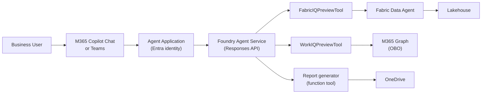

# Foundry Surface Architecture

The Foundry surface publishes the agent as an Azure AI Foundry Agent Application, accessible through M365 Copilot Chat and Teams. This is the production deployment path for business users.

## Architecture

## How it works

1. User @mentions the agent in M365 Copilot Chat or Teams
2. The Agent Application routes the request to the Foundry Agent Service
3. The Responses API matches intent to registered tools
4. Platform tools (FabricIQ, WorkIQ) handle data access with built-in auth
5. Custom function tools (report generator) execute business logic
6. Response is returned to the user with adaptive card formatting

## Key characteristics

| Aspect | Detail |
|---|---|
| **Orchestrator** | Foundry Responses API |
| **Tool protocol** | Foundry tool registration (platform + function tools) |
| **Auth** | OBO (on-behalf-of) via Entra |
| **Output** | Adaptive cards, DOCX links, rich formatting |
| **Infrastructure** | Azure AI Foundry (managed) |
| **Distribution** | M365 Copilot Chat, Teams, direct API |

## Components

| Component | Location | Purpose |
|---|---|---|
| Agent orchestrator | `src/orchestrator/` | Foundry agent configuration and tool wiring |
| Report generator | `src/agents/report_generator/` | DOCX generation + OneDrive upload |
| Infra (Bicep) | `infra/` | Foundry project, agent, Entra app registration |

## When to use the Foundry surface

- **Business users** — people who work in Teams and Outlook, not terminals
- **Enterprise distribution** — Entra identity, RBAC, compliance
- **Rich output** — DOCX reports, adaptive cards, OneDrive links
- **Production** — monitored, scalable, auditable

> 📖 [Azure AI Foundry](https://learn.microsoft.com/azure/ai-foundry/what-is-ai-foundry) · [Agent Applications](https://learn.microsoft.com/azure/ai-foundry/how-to/agents/agents-publish) · [M365 Copilot extensibility](https://learn.microsoft.com/microsoft-365-copilot/extensibility/)
