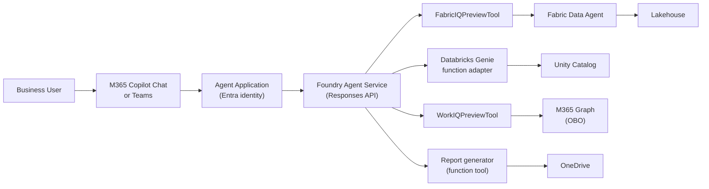
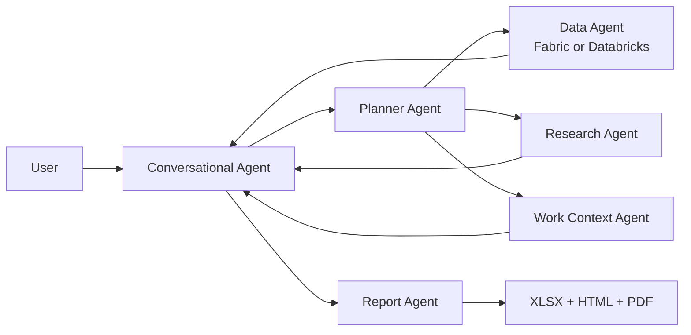

# Foundry Surface Architecture

The Foundry surface publishes the agent as an Azure AI Foundry Agent Application, accessible through M365 Copilot Chat and Teams. This is the production deployment path for business users.

## Architecture



## How it works

1. User @mentions the agent in M365 Copilot Chat or Teams
2. The Agent Application routes the request to the Foundry Agent Service
3. The Responses API matches intent to registered tools
4. Platform tools (FabricIQ, WorkIQ) handle data access with built-in auth
5. Custom function tools (report generator) execute business logic
6. Response is returned to the user with adaptive card formatting

## Project and portal experience

The dev hub is `fabric-agent-hub-dev` in `eastus2`. The workshop project is `fsa-project-dev` under that hub.
Create it if it is missing:

```powershell
az ml workspace create --kind Project --hub-id "/subscriptions/9450bd3b-96c5-48b2-bfdf-3374304efbd7/resourceGroups/rg-fabric-agent-dev/providers/Microsoft.MachineLearningServices/workspaces/fabric-agent-hub-dev" --name fsa-project-dev --resource-group rg-fabric-agent-dev --location eastus2
```

In the Foundry portal (`https://ai.azure.com`):

1. Open **fabric-agent-hub-dev** and select the **fsa-project-dev** project.
2. Open **Agents**. You should see the WWI single-agent registration and, for the advanced lab, the separate
   planner/data/research/work-context/conversation/report responsibilities described below.
3. Open an agent in **Playground** and run `Generate a quota report for Tailspin Toys`.
4. Open tracing or observability views and inspect the tool calls, latency, and generated artifact metadata.
5. Use **Publish** when the agent is ready for Microsoft 365 Copilot and Teams.

## Multi-agent pipeline alternative

The single-agent path is simplest: one Foundry agent has Fabric/Databricks, WorkIQ, research, and report tools.
The advanced path decomposes the same business outcome:



Use the multi-agent pattern when you need independent observability, separate ownership, or agent-specific
evaluation. Use the single-agent pattern when speed, fewer registrations, and simpler publishing matter more.
The working proof of concept is invocable with:

```powershell
uv run python -m src.orchestrator.multi_agent "Generate a quota report for Tailspin Toys" --customer "Tailspin Toys" --data-source fabric
uv run python -m src.orchestrator.multi_agent "Generate a quota report for Tailspin Toys" --customer "Tailspin Toys" --data-source databricks
```

## Key characteristics

| Aspect | Detail |
|---|---|
| **Orchestrator** | Foundry Responses API |
| **Tool protocol** | Foundry tool registration (platform + function tools) |
| **Auth** | OBO (on-behalf-of) via Entra |
| **Output** | Adaptive cards, DOCX links, rich formatting |
| **Infrastructure** | Azure AI Foundry (managed) |
| **Distribution** | M365 Copilot Chat, Teams, direct API |

## Components

| Component | Location | Purpose |
|---|---|---|
| Agent orchestrator | `src/orchestrator/` | Foundry agent configuration and tool wiring |
| Hosted agent runtime | `src/orchestrator/hosted_agent/` | Bring-your-own-code container with Fabric MCP, quota, research, attainment, activity, and report tools |
| Report generator | `src/agents/report_generator/` | DOCX generation + OneDrive upload |
| Infra (Bicep) | `infra/` | Foundry project, agent, Entra app registration |

## Hosted runtime configuration

Set these environment variables on the hosted container:

| Variable | Purpose |
|---|---|
| `FABRIC_MCP_URL` | Fabric Data Agent MCP endpoint |
| `FABRIC_MCP_TOOL_NAME` | MCP tool name to invoke for natural-language Fabric questions |
| `MODEL_ENDPOINT` | Optional endpoint for an injected Copilot SDK-compatible chat adapter |
| `MODEL_DEPLOYMENT` | Model deployment name, defaulting to `gpt-4o` |
| `HOSTED_AGENT_OUTPUT_DIR` | Output directory for generated quota artifacts |
| `COPILOT_HOME` | Optional credential/cache path if your Copilot SDK adapter requires it |

## When to use the Foundry surface

- **Business users** — people who work in Teams and Outlook, not terminals
- **Enterprise distribution** — Entra identity, RBAC, compliance
- **Rich output** — DOCX reports, adaptive cards, OneDrive links
- **Production** — monitored, scalable, auditable

> 📖 [Microsoft Foundry Agent Service](https://learn.microsoft.com/en-us/azure/foundry/agents/overview) · [Publish agents to Microsoft 365 Copilot and Teams](https://learn.microsoft.com/en-us/azure/foundry/agents/how-to/publish-copilot) · [Tracing for AI agents](https://learn.microsoft.com/en-us/azure/foundry/observability/how-to/trace-agent-setup)
