# System Overview

This page shows how all the pieces fit together — both delivery surfaces, shared backends, and the connections between them.

## Full system diagram

```mermaid
flowchart TB
    subgraph User["User Surfaces"]
        CLI["GitHub Copilot CLI\n(developer prototype)"]
        M365["M365 Copilot Chat / Teams\n(business users)"]
        Studio["Copilot Studio\n(low-code, documented)"]
    end

    subgraph Orchestration["Orchestration Layer"]
        CopilotEngine["Copilot CLI Engine\n(built-in orchestrator)"]
        FoundryPrompt["Foundry SalesAgent\n(prompt agent + tools)"]
        DbxSup["Databricks Supervisor\n(optional multi-sub-agent)"]
    end

    subgraph Tools["Tool Layer"]
        FDA["Fabric Data Agent\n(sales-data / fabric-core MCP)"]
        MKT["Market Data\n(market-data MCP)"]
        GENIE["Databricks Genie\n(API or MCP adapter)"]
        Skills["Skills + report/quota\n(MCP servers)"]
        FIQ["FabricIQPreviewTool"]
        WIQT["WorkIQPreviewTool"]
        Research["Web research function"]
        ReportFunc["Report generator\n(function tool)"]
    end

    subgraph External["External Agents"]
        MR["Market Research agent\n(ericchansen/market-research,\nseparate repo + IaC)"]
    end

    subgraph Backend["Shared Backend Services"]
        DA_SALES["Fabric Data Agent\n(internal sales lakehouse)"]
        DBX["Databricks Genie Space\n(Unity Catalog sales tables)"]
        DA_MKT["Market Data Lakehouse\n(SEC EDGAR real public companies)"]
        Graph["M365 Graph\n(WorkIQ activity)"]
        OD["OneDrive\n(report storage)"]
    end

    CLI --> CopilotEngine
    M365 --> FoundryPrompt
    Studio --> FoundryPrompt
    FoundryPrompt -.->|optional| DbxSup

    CopilotEngine --> FDA
    CopilotEngine --> MKT
    CopilotEngine --> GENIE
    CopilotEngine --> Skills

    FoundryPrompt --> FIQ
    FoundryPrompt --> WIQT
    FoundryPrompt --> Research
    FoundryPrompt --> ReportFunc
    FoundryPrompt -.->|deep research| MR

    FDA --> DA_SALES
    MKT --> DA_MKT
    GENIE --> DBX
    FIQ --> DA_SALES
    WIQT --> Graph
    Research -.->|web search| Web["External APIs"]
    MR -.->|market + web| Web
    ReportFunc --> OD

    style CLI fill:#e8f4fd,stroke:#0078d4,stroke-width:2px
    style M365 fill:#f3e8fd,stroke:#5B4B8A,stroke-width:2px
    style Studio fill:#f3e8fd,stroke:#5B4B8A,stroke-width:2px
    style DA_SALES fill:#fff3e0,stroke:#F57C00
    style DA_MKT fill:#fff3e0,stroke:#F57C00
    style MR fill:#e8fdf0,stroke:#107C10,stroke-width:2px
```

## Data flow

1. **User asks a question** in any surface (CLI, M365 Copilot / Teams, or Copilot Studio)
2. **Orchestrator selects tools** based on user intent — the Copilot CLI engine, or the Foundry SalesAgent prompt agent
3. **Chosen data backend** translates natural language to a governed query: Fabric Data Agent for Lakehouse data
   or Databricks Genie for Unity Catalog tables.
4. **Normalized sales rows** flow into the shared quota estimator. Fabric and Databricks can use different
   physical column names as long as they provide territory, category, order date, revenue, and quantity.
5. **WorkIQ** retrieves M365 activity signals via OBO auth or uses demo-safe synthetic activity.
6. **Web research** runs through the agent's research function; deep market and competitive analysis can route to the
   external Market Research agent ([`ericchansen/market-research`](https://github.com/ericchansen/market-research)).
7. **Report generator** produces XLSX, HTML, PDF, and DOCX artifacts depending on the surface.
8. **Response returned** to user with data, context, citations, and deliverables.

## Choose your data platform

| Backend | How it plugs in | Workshop proof point |
|---|---|---|
| **Microsoft Fabric** | Fabric Data Agent exposes an MCP endpoint consumed by Copilot CLI and wrapped by Foundry tools. | Native Microsoft analytics + MCP path. |
| **Databricks** | A Genie Space over Unity Catalog answers the same sales questions; an adapter passes rows to the estimator. | Existing Databricks estate can reuse the workshop without moving data. |

See [Choose Your Data Platform](../building-blocks/choose-data-platform) for the shared row contract.

## Single-agent vs. multi-agent patterns

The repository demonstrates three ways to reach the same quota-report outcome:

| Pattern | Where to look | Trade-off |
|---|---|---|
| Copilot CLI prototype | `.github/mcp.json`, `src/cli/`, `src/agents/` | Fastest iteration; developer-facing. |
| Single Foundry SalesAgent with tools | `src/orchestrator/foundry_agent.py` | Simpler production path; one agent pulls internal + external data and owns tool selection. |
| Separate sub-agents | `src/orchestrator/databricks_supervisor.py`; external [`ericchansen/market-research`](https://github.com/ericchansen/market-research) | More observable and composable; data and research responsibilities are owned by dedicated agents. |

## Key design decisions

### Why two surfaces?
Different users need different experiences. Developers iterate faster in a terminal. Business users live in Teams and Outlook. Same agent logic, different distribution.

### Why MCP?
MCP standardizes tool discovery and calling. Write a tool server once, connect it to any MCP-compatible agent. The Fabric Data Agent already exposes an MCP endpoint — no custom wrapper needed.

### Why Foundry for production?
Foundry provides enterprise-grade agent hosting: Entra identity, RBAC, monitoring, and publishing to M365 — things that are hard to build yourself.

### Why not just one surface?
You *could* deploy only the Foundry surface. But the CLI surface gives you a zero-infrastructure prototyping environment. Changes to your MCP servers and skills take effect immediately — no deployment, no registration, no waiting. That feedback loop is critical during development.

## Further reading

- [Architecture: CLI surface](./cli-surface)
- [Architecture: Foundry surface](./foundry-surface)
- [Architecture: Auth patterns](./auth-patterns)
