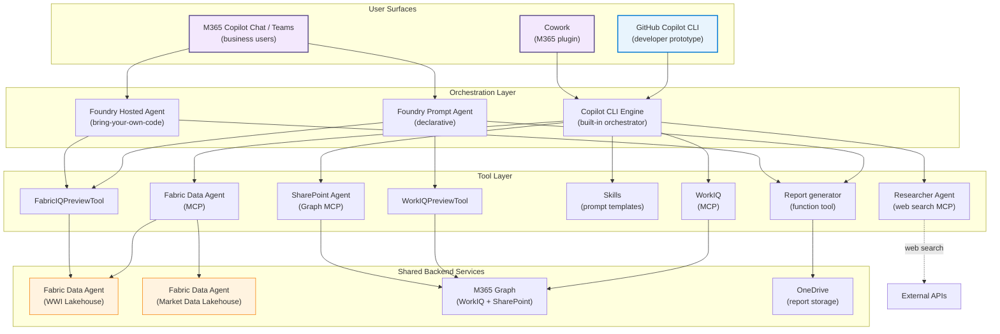

# System Overview

This page shows how all the pieces fit together — both delivery surfaces, shared backends, and the connections between them.

## Full system diagram

## Data flow

1. **User asks a question** in any surface (CLI, M365 Copilot, or Cowork)
2. **Orchestrator selects tools** based on user intent — Copilot CLI engine, Foundry Prompt Agent, or Foundry Hosted Agent
3. **Fabric Data Agent** translates NL→SQL and queries the Lakehouse (WWI sales data or market/SEC data)
4. **WorkIQ** retrieves M365 activity signals via OBO auth
5. **Researcher Agent** performs web research with configurable search providers (Bing, Tavily, or mock)
6. **SharePoint Agent** retrieves internal documents via Microsoft Graph
7. **Report generator** (Foundry) produces DOCX/PPTX and uploads to OneDrive
8. **Response returned** to user with data, context, and deliverables

## Key design decisions

### Why two surfaces?
Different users need different experiences. Developers iterate faster in a terminal. Business users live in Teams and Outlook. Same agent logic, different distribution.

### Why MCP?
MCP standardizes tool discovery and calling. Write a tool server once, connect it to any MCP-compatible agent. The Fabric Data Agent already exposes an MCP endpoint — no custom wrapper needed.

### Why Foundry for production?
Foundry provides enterprise-grade agent hosting: Entra identity, RBAC, monitoring, and publishing to M365 — things that are hard to build yourself.

### Why not just one surface?
You *could* deploy only the Foundry surface. But the CLI surface gives you a zero-infrastructure prototyping environment. Changes to your MCP servers and skills take effect immediately — no deployment, no registration, no waiting. That feedback loop is critical during development.

## Further reading

- [Architecture: CLI surface](./cli-surface)
- [Architecture: Foundry surface](./foundry-surface)
- [Architecture: Auth patterns](./auth-patterns)
