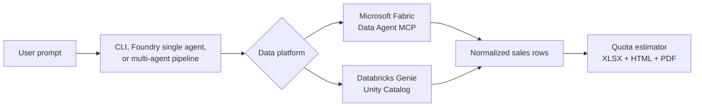

# Choose Your Data Platform

The workshop supports two data backends. Pick one for Day 1, keep the rest of the agent workflow unchanged,
and compare how the same quota report is produced from different governed data platforms.

## Platform decision guide

| Choose | When it is the right fit | What the agent calls | Governance plane |
|---|---|---|---|
| **Microsoft Fabric** | Your workshop data is in a Lakehouse and you want native MCP from Fabric Data Agent. | `api.fabric.microsoft.com/v1/mcp/workspaces/{workspace-id}/dataagent` | Fabric workspace roles and OneLake permissions |
| **Databricks** | Your customer already curates sales data in Azure Databricks and governs it with Unity Catalog. | Genie Spaces Conversation API or a thin MCP adapter around it | Unity Catalog catalogs, schemas, tables, and permissions |

## Shared row contract

Every backend must return the same business concepts. The Python estimator accepts canonical names and common
Fabric/Databricks aliases:

| Concept | Fabric examples | Databricks examples |
|---|---|---|
| Territory | `territory`, `SalesTerritory`, `TerritoryName` | `sales_territory`, `salesTerritory`, `territory_name_uc` |
| Category | `category`, `ProductCategory`, `StockItemCategory` | `productCategory`, `item_category` |
| Order date | `order_date`, `OrderDate`, `SalesOrderDate` | `orderDate`, `order_timestamp` |
| Revenue | `revenue`, `TotalDue`, `ExtendedPrice` | `net_sales_amount`, `gross_sales_amount`, `salesAmount` |
| Quantity | `quantity`, `QuantitySold` | `units_sold`, `sold_quantity`, `quantitySold` |

Add `source_platform: "fabric"` or `source_platform: "databricks"` when you want automatic methodology and
citation text. You can also pass `data_source: "fabric"` or `data_source: "databricks"` explicitly to
`generate_quota_estimation_report`.

## Day 1 implementation steps

1. **Create the semantic data endpoint.** In Fabric, create a Data Agent over the WWI Lakehouse. In Databricks,
   create a Genie Space over Unity Catalog sales tables.
2. **Teach the endpoint the row contract.** Add instructions and examples that force the five required concepts
   above. This is more important than matching physical column names.
3. **Test one golden query.** Use `What were Tailspin Toys' total sales by product category for the last 12 months?`
   and confirm the returned rows contain territory, category, date, revenue, and quantity.
4. **Generate the report.** Pass those rows to the quota estimator from the CLI, Foundry function tool, or
   multi-agent pipeline.

## Further reading

- [Fabric Data Agent](./fabric-data-agent)
- [Databricks Genie](./databricks-genie)
- [Quota Estimation Pipeline](./quota-pipeline)
- [Genie Spaces](https://learn.microsoft.com/en-us/azure/databricks/genie/)
- [Unity Catalog](https://learn.microsoft.com/en-us/azure/databricks/data-governance/unity-catalog/)
