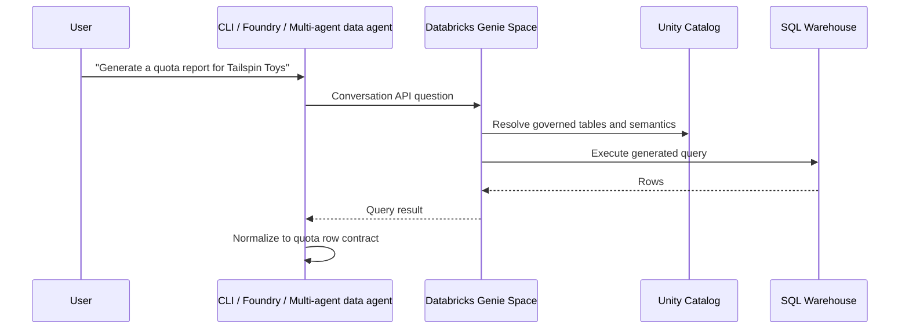

# Databricks Genie + Unity Catalog

Databricks Genie Spaces are natural-language interfaces over governed Databricks data. In this workshop they are
the alternative data backend to Fabric Data Agent: business users ask questions in plain English, Genie grounds
the answer in Unity Catalog tables, and the agent normalizes the result rows for the shared quota pipeline.

## Architecture



## Genie, managed MCP, and Supervisor

Genie is the semantic data agent for governed sales questions. You can expose it to the workshop through:

| Pattern | What it does | Workshop role |
|---|---|---|
| Genie Conversation API | Direct SDK adapter in `src/orchestrator/databricks_genie.py`. | Simple live smoke and Foundry function-tool path. |
| Genie managed MCP | Databricks-hosted MCP server, selected with `DATABRICKS_GENIE_MCP_URL`. | Platform-managed tool endpoint for agents. |
| Genie inside Supervisor Agent | Genie Space becomes one subagent/tool inside a Databricks Supervisor Agent. | Advanced Databricks-native multi-agent comparison. |

Use [Databricks Supervisor Agent](./databricks-supervisor) when the customer wants Databricks to own multi-agent
routing across Genie, UC functions, tables, search, and custom agents. Use this page when the task is simply "ask a
Genie Space for governed rows and feed the quota pipeline."

## Setup checklist

| Step | What to do | Validation |
|---|---|---|
| Unity Catalog | Put sales tables in a catalog/schema with clear names and descriptions. | Users or service principals can `SELECT` the tables. |
| SQL warehouse | Attach a warehouse sized for workshop concurrency. | A sample SQL query returns WWI-like rows. |
| Genie Space | Add up to the relevant sales tables, trusted SQL examples, and instructions. | Genie answers the golden Tailspin Toys query. |
| Agent adapter | Call the Genie Spaces API or expose it through an MCP adapter. | The agent receives rows with required business concepts. |
| Quota pipeline | Pass `data_source: "databricks"` to report generation. | Methodology cites Databricks Genie and Unity Catalog. |

## Genie instruction starter

Paste instructions like these into the Genie Space and tailor table names for your catalog:

```text
You answer sales and quota questions for the WWI workshop. For quota report requests,
return row-level historical sales with these columns or aliases:
sales_territory, productCategory, orderDate, net_sales_amount, units_sold.
Use Unity Catalog table descriptions and trusted SQL examples. Prefer the last
12 complete months unless the user asks for a different period.
```

## API integration pattern

There are three supported integration paths. Start with the SDK path because it is testable from the repo; move
to managed MCP when your Databricks workspace and governance model are ready for a hosted MCP endpoint.

| Path | How it works | Use it when |
|---|---|---|
| SDK Conversation API | `src/orchestrator/databricks_genie.py` uses the Databricks SDK `WorkspaceClient.genie` adapter and normalizes query results. | You want the simplest live smoke and a Python function tool in the Foundry `SalesAgent`. |
| Managed MCP | `src/orchestrator/databricks_genie.py` selects `DatabricksGenieMcpClient` when `DATABRICKS_GENIE_MCP_URL` is set, calling the Databricks-hosted Genie MCP server (Unity Catalog permissions enforced server-side). | You want a platform-managed MCP surface for agents instead of custom adapter code. |
| Offline fallback | The Genie adapter emits deterministic Databricks-shaped rows. | You need to teach the architecture without a live workspace or DBU spend. |

The SDK path uses the Genie Spaces API from a thin data-agent adapter. This repo includes that adapter in
`src/orchestrator/databricks_genie.py` and exposes it as the `databricks_query` tool in the Foundry
`SalesAgent` surface.

1. Start or continue a conversation for the user request.
2. Poll until the answer is complete.
3. Extract tabular query results.
4. Rename columns only when needed; the estimator already accepts Databricks aliases.
5. Attach `source_platform: "databricks"` to each row.

Configure these environment variables for a live smoke test:

```dotenv
DATABRICKS_WORKSPACE_URL=https://adb-<workspace-id>.<region>.azuredatabricks.net
DATABRICKS_HOST=https://adb-<workspace-id>.<region>.azuredatabricks.net
DATABRICKS_GENIE_SPACE_ID=<genie-space-id>
# Optional, but recommended for governance and repeatability:
DATABRICKS_GENIE_WAREHOUSE_ID=<sql-warehouse-id>
# Auth for unattended CI (preferred):
DATABRICKS_CLIENT_ID=<service-principal-client-id>
DATABRICKS_CLIENT_SECRET=<service-principal-secret>
# Auth alternative for local single-user testing:
DATABRICKS_TOKEN=<personal-access-token>
```

Then ask the Foundry `SalesAgent` for a Databricks-backed sales question:

```powershell
uv run python -m src.orchestrator "Use Databricks Genie to show sales by territory for Tailspin Toys"
```

That exact command is the live Genie smoke. When the question mentions "Databricks Genie", the module directly
calls the SDK adapter and prints JSON. A configured run returns `status: "ok"`, `rows`, `conversation_id`,
`message_id`, and `source_platform: "databricks"` so the quota pipeline can call
`generate_quota_estimation_report` without changing the estimator. With env unset, it exits with
`status: "configuration_error"` and lists the required variables.

The single Foundry `SalesAgent` in `src/orchestrator/foundry_agent.py` and the Databricks Supervisor in
`src/orchestrator/databricks_supervisor.py` demonstrate this boundary with deterministic Databricks-shaped rows when a live workspace is not configured.

## Managed MCP transport (DATABRICKS_GENIE_MCP_URL)

The same `databricks_query` tool can talk to a **Databricks managed MCP Genie server** instead of the SDK
Conversation API. The selection is explicit and non-breaking: set `DATABRICKS_GENIE_MCP_URL` and the adapter
routes through `DatabricksGenieMcpClient`; leave it unset and the SDK-direct path is used unchanged.

The managed MCP Genie endpoint has the shape:

```text
https://<workspace-hostname>/api/2.0/mcp/genie/<genie-space-id>
```

Find it in your workspace under **AI Gateway → MCPs**. Enable the optional dependency, then configure the URL:

```powershell
# Install the optional managed-MCP client (the SDK-direct path needs no extras).
uv sync --extra dev --extra databricks-mcp
```

```dotenv
# When set, the agent uses the managed MCP Genie server instead of the SDK adapter.
DATABRICKS_GENIE_MCP_URL=https://adb-<workspace-id>.<region>.azuredatabricks.net/api/2.0/mcp/genie/<genie-space-id>
DATABRICKS_HOST=https://adb-<workspace-id>.<region>.azuredatabricks.net
DATABRICKS_CLIENT_ID=<service-principal-client-id>
DATABRICKS_CLIENT_SECRET=<service-principal-secret>
```

The adapter discovers the Genie query tool via `list_tools()`, calls it with the natural-language question, and
normalizes the returned content into the same quota-row contract (`source_platform: "databricks"`), so the quota
pipeline is unchanged regardless of transport. The response includes `transport: "managed-mcp"` and the resolved
`tool_name` so you can confirm which path ran.

### Authentication modes

Databricks managed MCP servers are secure by default and enforce Unity Catalog permissions server-side. The
`WorkspaceClient` backing the MCP client resolves credentials from the standard Databricks unified auth chain, so
pick the mode that matches where the agent runs:

| Mode | When to use | How to configure |
|---|---|---|
| **PAT** (personal access token) | Quick local testing for a single user. | `DATABRICKS_HOST` + `DATABRICKS_TOKEN`. |
| **U2M** (user-to-machine OAuth) | Interactive development; actions run as you. | `databricks auth login --host https://<workspace-hostname>`, then reference the CLI profile. |
| **M2M** (machine-to-machine OAuth) | Unattended agents / CI service principals. | Service principal `DATABRICKS_CLIENT_ID` + `DATABRICKS_CLIENT_SECRET` (+ `DATABRICKS_HOST`). |
| **OBO** (on-behalf-of-user) | Agents that must act as the calling user so UC permissions are evaluated per user. | Provide the user token to the MCP client per request; include the Genie OAuth scope for the server. |

For unattended workshop CI, prefer **M2M** with a service principal that has `SELECT` on the Genie Space tables.
For published Foundry/M365 agents where each user should only see their own governed data, use **OBO** so Unity
Catalog enforces per-user access on every query.

The Live Smoke workflow maps both PAT and OAuth M2M secrets into the Databricks job. Set `DATABRICKS_HOST`
alongside `DATABRICKS_GENIE_MCP_URL` for managed MCP, or set `DATABRICKS_WORKSPACE_URL` +
`DATABRICKS_GENIE_SPACE_ID` for SDK-direct. In either transport, provide `DATABRICKS_CLIENT_ID` and
`DATABRICKS_CLIENT_SECRET` for OAuth M2M or `DATABRICKS_TOKEN` for a PAT-backed smoke.

## Live smoke test (environment-gated)

A **live** Genie call is optional and only runs when you point the adapter at a real workspace. Treat it as
env-gated: without these variables, the Genie adapter returns a clear configuration error and the live Genie
checkpoint is **blocked**, not equivalent to a Fabric-backed run. The unit tests and offline adapter fallback
still use deterministic Databricks-shaped rows so the workshop can be completed offline.

**Prerequisites for a live run:**

1. **Unity Catalog tables** — your WWI-style sales tables exist in a catalog/schema your principal can `SELECT`.
2. **A Genie Space** built over those tables, with trusted SQL examples and the row-contract instructions above.
3. **A SQL warehouse** attached to the Genie Space (or referenced via `DATABRICKS_GENIE_WAREHOUSE_ID`).
4. **Authentication** — the `databricks-sdk` `WorkspaceClient` resolves credentials from the standard Databricks
   auth chain (env vars, `~/.databrickscfg` profile, or Azure CLI / managed identity).

:::tip[Smoke either transport]

The same smoke command exercises whichever transport is configured. Set `DATABRICKS_GENIE_MCP_URL` to run it over
the managed MCP server, or set `DATABRICKS_WORKSPACE_URL` + `DATABRICKS_GENIE_SPACE_ID` for the SDK-direct path.
The Live Smoke workflow reports the Databricks check as RAN, SKIPPED, or FAILED accordingly.
:::

**Run the smoke test** once the three environment variables are set:

```powershell
uv run python -m src.orchestrator "Use Databricks Genie to show sales by territory for Tailspin Toys"
```

A successful run returns normalized rows plus the `conversation_id` / `message_id` that prove the Conversation
API round-trip worked. If the variables are unset, record live Genie as blocked and use the offline adapter
fallback for the deterministic offline checkpoint.

:::caution[Genie Agent Mode billing — know this before you demo live]

Genie runs on a **serverless, pay-as-you-go** model billed in DBUs, not a flat license. **Genie billing starts
July 6, 2026** — before that date usage was not billed. Two cost lines stack up:

- **Genie LLM usage** — each identified user gets **150 free Genie DBUs/month** (~80–100 questions, ~$10.50/mo
  value at $0.07/DBU in US East), covering Genie, Genie Spaces, and Genie Code. Beyond that you pay the per-DBU
  Genie rate. Every conversational turn (and every API call that triggers a query) consumes from this allowance.
- **Compute** — the SQL warehouse Genie uses to execute generated queries is billed separately at the warehouse's
  DBU rate. Larger warehouses and bigger scans cost more per question.

For a workshop room driving many live questions, this adds up. Right-size the SQL warehouse, set
[Genie budgets and cost controls](https://learn.microsoft.com/en-us/azure/databricks/genie/budgets) with alerts,
and prefer the deterministic offline fallback for large groups. See the
[Genie pricing page](https://www.databricks.com/product/pricing/genie) for current rates.
:::

## Further reading

- [Genie Spaces](https://learn.microsoft.com/en-us/azure/databricks/genie/)
- [Create and manage a Genie Space](https://learn.microsoft.com/en-us/azure/databricks/genie/set-up)
- [Use the Genie Spaces API](https://learn.microsoft.com/en-us/azure/databricks/genie/conversation-api)
- [Managed MCP servers in Azure Databricks](https://learn.microsoft.com/en-us/azure/databricks/generative-ai/mcp/managed-mcp)
- [Databricks Supervisor Agent](https://learn.microsoft.com/en-us/azure/databricks/generative-ai/agent-bricks/multi-agent-supervisor)
- [Manage budgets and cost controls for Genie](https://learn.microsoft.com/en-us/azure/databricks/genie/budgets)
- [Unity Catalog](https://learn.microsoft.com/en-us/azure/databricks/data-governance/unity-catalog/)
