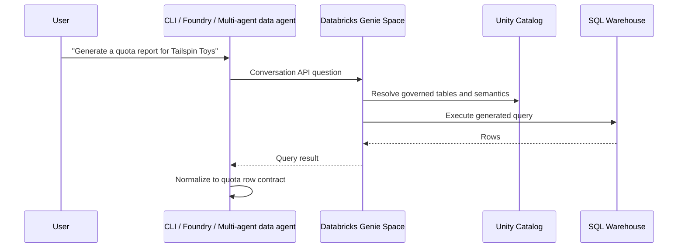

# Databricks Genie + Unity Catalog

Databricks Genie Spaces are natural-language interfaces over governed Databricks data. In this workshop they are
the alternative data backend to Fabric Data Agent: business users ask questions in plain English, Genie grounds
the answer in Unity Catalog tables, and the agent normalizes the result rows for the shared quota pipeline.

## Architecture



## Setup checklist

| Step | What to do | Validation |
|---|---|---|
| Unity Catalog | Put sales tables in a catalog/schema with clear names and descriptions. | Users or service principals can `SELECT` the tables. |
| SQL warehouse | Attach a warehouse sized for workshop concurrency. | A sample SQL query returns WWI-like rows. |
| Genie Space | Add up to the relevant sales tables, trusted SQL examples, and instructions. | Genie answers the golden Tailspin Toys query. |
| Agent adapter | Call the Genie Spaces API or expose it through an MCP adapter. | The agent receives rows with required business concepts. |
| Quota pipeline | Pass `data_source: "databricks"` to report generation. | Methodology cites Databricks Genie and Unity Catalog. |

## Genie instruction starter

Paste instructions like these into the Genie Space and tailor table names for your catalog:

```text
You answer sales and quota questions for the WWI workshop. For quota report requests,
return row-level historical sales with these columns or aliases:
sales_territory, productCategory, orderDate, net_sales_amount, units_sold.
Use Unity Catalog table descriptions and trusted SQL examples. Prefer the last
12 complete months unless the user asks for a different period.
```

## API integration pattern

Use the Genie Spaces API from a thin data-agent adapter:

1. Start or continue a conversation for the user request.
2. Poll until the answer is complete.
3. Extract tabular query results.
4. Rename columns only when needed; the estimator already accepts Databricks aliases.
5. Attach `source_platform: "databricks"` to each row.

The multi-agent proof of concept in `src/orchestrator/multi_agent/` demonstrates this boundary with deterministic
Databricks-shaped rows. Replace the demo data-agent function with a real Genie API caller when you connect a
workspace.

## Further reading

- [Genie Spaces](https://learn.microsoft.com/en-us/azure/databricks/genie/)
- [Create and manage a Genie Space](https://learn.microsoft.com/en-us/azure/databricks/genie/set-up)
- [Use the Genie Spaces API](https://learn.microsoft.com/en-us/azure/databricks/genie/conversation-api)
- [Unity Catalog](https://learn.microsoft.com/en-us/azure/databricks/data-governance/unity-catalog/)
