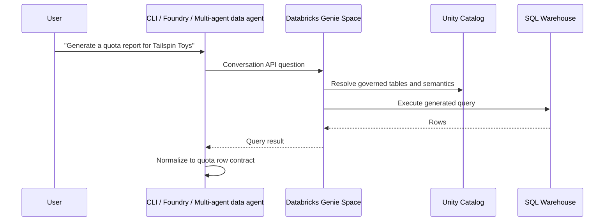

# Databricks Genie + Unity Catalog

Databricks Genie Spaces are natural-language interfaces over governed Databricks data. In this workshop they are
the alternative data backend to Fabric Data Agent: business users ask questions in plain English, Genie grounds
the answer in Unity Catalog tables, and the agent normalizes the result rows for the shared quota pipeline.

## Architecture



## Setup checklist

| Step | What to do | Validation |
|---|---|---|
| Unity Catalog | Put sales tables in a catalog/schema with clear names and descriptions. | Users or service principals can `SELECT` the tables. |
| SQL warehouse | Attach a warehouse sized for workshop concurrency. | A sample SQL query returns WWI-like rows. |
| Genie Space | Add up to the relevant sales tables, trusted SQL examples, and instructions. | Genie answers the golden Tailspin Toys query. |
| Agent adapter | Call the Genie Spaces API or expose it through an MCP adapter. | The agent receives rows with required business concepts. |
| Quota pipeline | Pass `data_source: "databricks"` to report generation. | Methodology cites Databricks Genie and Unity Catalog. |

## Genie instruction starter

Paste instructions like these into the Genie Space and tailor table names for your catalog:

```text
You answer sales and quota questions for the WWI workshop. For quota report requests,
return row-level historical sales with these columns or aliases:
sales_territory, productCategory, orderDate, net_sales_amount, units_sold.
Use Unity Catalog table descriptions and trusted SQL examples. Prefer the last
12 complete months unless the user asks for a different period.
```

## API integration pattern

Use the Genie Spaces API from a thin data-agent adapter. This repo includes a Databricks SDK-backed adapter in
`src/orchestrator/databricks_genie.py` and exposes it as the `databricks_query` tool in the Foundry and hosted
agent surfaces.

1. Start or continue a conversation for the user request.
2. Poll until the answer is complete.
3. Extract tabular query results.
4. Rename columns only when needed; the estimator already accepts Databricks aliases.
5. Attach `source_platform: "databricks"` to each row.

Configure these environment variables for a live smoke test:

```dotenv
DATABRICKS_WORKSPACE_URL=https://adb-<workspace-id>.<region>.azuredatabricks.net
DATABRICKS_GENIE_SPACE_ID=<genie-space-id>
# Optional, but recommended for governance and repeatability:
DATABRICKS_GENIE_WAREHOUSE_ID=<sql-warehouse-id>
```

Then ask the hosted or Foundry agent for a Databricks-backed sales question:

```powershell
uv run python -m src.orchestrator "Use Databricks Genie to show sales by territory for Tailspin Toys"
```

The tool returns `rows`, `conversation_id`, `message_id`, and `source_platform: "databricks"` so the quota pipeline
can call `generate_quota_estimation_report` without changing the estimator.

The multi-agent proof of concept in `src/orchestrator/multi_agent/` demonstrates this boundary with deterministic
Databricks-shaped rows when a live workspace is not configured.

## Live smoke test (environment-gated)

A **live** Genie call is optional and only runs when you point the adapter at a real workspace. Treat it as
env-gated: without these variables, the Genie adapter returns a clear configuration error and the live Genie
checkpoint is **blocked**, not equivalent to a Fabric-backed run. The unit tests and multi-agent proof of concept
still use deterministic Databricks-shaped rows so the workshop can be completed offline.

**Prerequisites for a live run:**

1. **Unity Catalog tables** — your WWI-style sales tables exist in a catalog/schema your principal can `SELECT`.
2. **A Genie Space** built over those tables, with trusted SQL examples and the row-contract instructions above.
3. **A SQL warehouse** attached to the Genie Space (or referenced via `DATABRICKS_GENIE_WAREHOUSE_ID`).
4. **Authentication** — the `databricks-sdk` `WorkspaceClient` resolves credentials from the standard Databricks
   auth chain (env vars, `~/.databrickscfg` profile, or Azure CLI / managed identity).

**Run the smoke test** once the three environment variables are set:

```powershell
uv run python -m src.orchestrator "Use Databricks Genie to show sales by territory for Tailspin Toys"
```

A successful run returns normalized rows plus the `conversation_id` / `message_id` that prove the Conversation
API round-trip worked. If the variables are unset, record live Genie as blocked and use the multi-agent PoC
command below for the deterministic offline checkpoint.

:::caution Genie Agent Mode billing — know this before you demo live
Genie runs on a **serverless, pay-as-you-go** model billed in DBUs, not a flat license. Two cost lines stack up:

- **Genie LLM usage** — each user gets a free monthly allowance of Genie DBUs; beyond that you pay the per-DBU
  Genie rate. Every conversational turn (and every API call that triggers a query) consumes from this.
- **Compute** — the SQL warehouse Genie uses to execute generated queries is billed separately at the warehouse's
  DBU rate. Larger warehouses and bigger scans cost more per question.

For a workshop room driving many live questions, this adds up. Right-size the SQL warehouse, set
[Genie budgets and cost controls](https://learn.microsoft.com/en-us/azure/databricks/genie/budgets) with alerts,
and prefer the deterministic offline fallback for large groups. See the
[Genie pricing page](https://www.databricks.com/product/pricing/genie) for current rates.
:::

## Further reading

- [Genie Spaces](https://learn.microsoft.com/en-us/azure/databricks/genie/)
- [Create and manage a Genie Space](https://learn.microsoft.com/en-us/azure/databricks/genie/set-up)
- [Use the Genie Spaces API](https://learn.microsoft.com/en-us/azure/databricks/genie/conversation-api)
- [Manage budgets and cost controls for Genie](https://learn.microsoft.com/en-us/azure/databricks/genie/budgets)
- [Unity Catalog](https://learn.microsoft.com/en-us/azure/databricks/data-governance/unity-catalog/)
