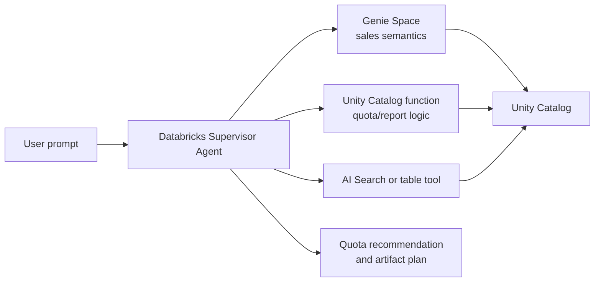

# Databricks Supervisor Agent

Databricks Supervisor Agent is the Databricks-native multi-agent option for customers who want orchestration to stay
inside Azure Databricks and Unity Catalog. It sits beside the Foundry single-agent and Python multi-agent patterns in
this workshop; it is not required for the main path.

## Where it fits



Use this path when:

- the customer's governed data, functions, and AI Gateway are already in Databricks;
- Unity Catalog should enforce permissions for every subagent and tool;
- the workshop goal is to compare Databricks-native orchestration with Azure AI Foundry orchestration;
- the team wants Databricks UI configuration first, then an API path for automation.

Stay on the Foundry/Python path when the target channel is Microsoft 365 Copilot, when you need Foundry portal evals
and publishing, or when the customer has not enabled Databricks serverless/AI Gateway prerequisites.

## Supervisor Agent vs Supervisor API

| Capability | Supervisor Agent | Supervisor API |
|---|---|---|
| Status | GA no-code/UI agent | Beta programmatic API |
| Authoring | Databricks workspace UI, **Agents > Create Agent > Supervisor** | OpenResponses-compatible calls through AI Gateway |
| Loop owner | Databricks | Databricks |
| Best for | Declarative routing across Genie, dashboards, UC functions, tables, search, and agents | App code that chooses model/tools at runtime |
| Workshop use | Advanced comparison/demo | Mocked request builder and optional live smoke |

The API endpoint is OpenResponses-compatible and Databricks manages the loop: model call, tool execution, repeat,
final answer. The helper in `src/orchestrator/databricks_supervisor.py` builds this request shape without importing
live Databricks dependencies during offline tests.

## Required Databricks setup

| Requirement | Why it matters |
|---|---|
| Unity Catalog | Governs tables, functions, volumes, search indexes, and external connections. |
| Serverless compute and Model Serving | Required by Databricks agent features. |
| Unity AI Gateway for agents | Required for Supervisor API and managed routing. |
| A nonzero serverless usage policy budget | Prevents hidden spend and makes live labs explicit. |
| End-user permissions | UC permissions are evaluated per subagent/tool, not bypassed by the supervisor. |

Common subagent permissions include `CAN RUN` on Genie spaces, `SELECT` plus `USE CATALOG` / `USE SCHEMA` on tables,
`EXECUTE` on UC functions, `CAN QUERY` on model serving endpoints, `USE CONNECTION` for external MCP servers, and
`CAN USE` on Databricks Apps used as custom MCP or custom agents.

## API request helper

Build a Supervisor API payload for the same WWI quota workflow. The helper now wires the full set of hosted tool
types the Supervisor API supports — Genie spaces, UC functions, AI/BI dashboards, Knowledge Assistants, and custom
agents served from Model Serving endpoints — and an optional Unity Catalog trace destination:

```python
from src.orchestrator.databricks_supervisor import (
    SupervisorTraceDestination,
    build_quota_supervisor_request,
)

request = build_quota_supervisor_request(
    "Generate an aggressive quota report for Tailspin Toys",
    customer_name="Tailspin Toys",
    genie_space_id="<genie-space-id>",
    quota_function_name="<catalog>.<schema>.generate_quota_report",
    dashboard_id="<dashboard-id>",                       # optional AI/BI dashboard tool
    knowledge_assistant_id="<knowledge-assistant-id>",   # optional unstructured retrieval
    serving_endpoint_name="<serving-endpoint-name>",     # optional custom agent
    trace_destination=SupervisorTraceDestination(        # optional UC trace tables
        catalog_name="<catalog>",
        schema_name="<schema>",
        table_prefix="supervisor_traces",
    ),
)

payload = request.to_payload()
```

Each tool maps to the exact nested configuration the Supervisor API expects (the nested key matches the `type`
discriminator):

| Tool type | Helper | Nested config |
|---|---|---|
| `genie_space` | `SupervisorToolSpec.genie_space` | `{"space_id": ...}` |
| `uc_function` | `SupervisorToolSpec.uc_function` | `{"name": "<catalog>.<schema>.<function>"}` |
| `uc_table` | `SupervisorToolSpec.unity_catalog_table` | `{"name": "<catalog>.<schema>.<table>"}` |
| `dashboard` | `SupervisorToolSpec.dashboard` | `{"dashboard_id": ...}` |
| `knowledge_assistant` | `SupervisorToolSpec.knowledge_assistant` | `{"knowledge_assistant_id": ...}` |
| `serving_endpoint` | `SupervisorToolSpec.serving_endpoint` | `{"name": "<endpoint-name>"}` |

### Tracing the agent loop

The Supervisor API writes OpenTelemetry traces to Unity Catalog only when you pass a `trace_destination`. The helper
serializes it through the Databricks client's `extra_body`, matching the API reference. Set it directly (above) or via
environment for the tool entry point:

```powershell
$env:DATABRICKS_SUPERVISOR_TRACE_CATALOG="<catalog>"
$env:DATABRICKS_SUPERVISOR_TRACE_SCHEMA="<schema>"
$env:DATABRICKS_SUPERVISOR_TRACE_TABLE_PREFIX="supervisor_traces"
```

Storing traces in Unity Catalog and the Unity AI Gateway are **Beta** previews a workspace admin enables on the
**Previews** page before the Supervisor API will accept requests.

For a live call, install the optional Databricks client and provide Databricks unified-auth credentials:

```powershell
pip install databricks-openai
$env:DATABRICKS_HOST="https://<workspace-hostname>"
$env:DATABRICKS_TOKEN="<pat-or-use-oauth-profile>"
$env:DATABRICKS_SUPERVISOR_GENIE_SPACE_ID="<genie-space-id>"
$env:DATABRICKS_SUPERVISOR_QUOTA_FUNCTION="<catalog>.<schema>.generate_quota_report"
```

The workshop does not require a live Supervisor API call. Unit tests validate the payload shape and configuration
errors offline:

```powershell
uv run pytest tests/unit/test_databricks_genie_client.py tests/unit/test_databricks_supervisor.py
```

## Comparison with Foundry multi-agent

| Question | Databricks Supervisor | Foundry / Python multi-agent |
|---|---|---|
| Where do tools live? | Databricks Genie, UC functions, tables, search, dashboards, model endpoints, MCP servers. | Foundry tools, Python functions, Fabric/Databricks adapters, hosted-agent container. |
| Who governs data? | Unity Catalog. | Fabric workspace/OneLake, Foundry connections, Databricks UC when using Genie. |
| How do you publish to M365? | Not the primary path; bridge through a Foundry/hosted surface if needed. | Native workshop path through Foundry and Microsoft 365 publishing. |
| How do you evaluate? | Databricks traces/feedback and MLflow/AI Gateway observability. | Foundry traces plus `azd ai agent eval` lab. |
| Best workshop role | Advanced Databricks-native comparison. | Main two-day path. |

## References

- [Databricks Supervisor Agent](https://learn.microsoft.com/en-us/azure/databricks/generative-ai/agent-bricks/multi-agent-supervisor)
- [Databricks Supervisor API](https://learn.microsoft.com/en-us/azure/databricks/generative-ai/agent-bricks/supervisor-api)
- [Managed MCP servers in Azure Databricks](https://learn.microsoft.com/en-us/azure/databricks/generative-ai/mcp/managed-mcp)
- [Unity Catalog](https://learn.microsoft.com/en-us/azure/databricks/data-governance/unity-catalog/)
