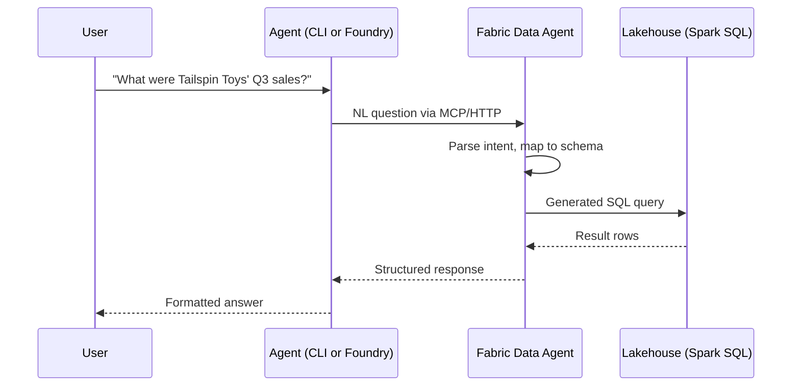

# Microsoft Fabric Data Agent

The Fabric Data Agent is the data backbone of this accelerator. It translates natural language questions into SQL queries against a [Fabric Lakehouse](https://learn.microsoft.com/fabric/data-engineering/lakehouse-overview), executes them, and returns structured results. This lets your agent answer questions about real business data without writing SQL.

## How it works



The Data Agent handles:
- **Schema grounding** — it knows your table names, column names, and relationships
- **NL→SQL translation** — converts questions to Spark SQL
- **Query execution** — runs the SQL against the Lakehouse
- **Result formatting** — returns structured data the agent can present

## Key concepts

### Lakehouse
A Fabric Lakehouse combines the flexibility of a data lake with the structure of a data warehouse. Tables are stored in Delta Lake format and queryable via Spark SQL. The WWI sample data includes 6 tables covering customers, orders, products, salespeople, and territories.

> 📖 [What is a Lakehouse?](https://learn.microsoft.com/fabric/data-engineering/lakehouse-overview) · [Delta Lake format](https://learn.microsoft.com/fabric/data-engineering/lakehouse-and-delta-tables)

### Data Agent configuration
The Data Agent is configured in the Fabric portal. You specify which Lakehouse tables it can access, add instructions for query generation (e.g., "fiscal year starts in July"), and optionally provide few-shot examples for complex queries.

Configuration for this accelerator lives in `fabric/` in the repo:
- `fabric/data-agent-instructions.md` — system prompt for query generation
- `fabric/few-shot-examples.json` — example question→SQL pairs

> 📖 [Create a Data Agent](https://learn.microsoft.com/fabric/data-engineering/data-agent-create) · [Configure instructions](https://learn.microsoft.com/fabric/data-engineering/data-agent-instructions)

### MCP endpoint
The Data Agent exposes an HTTP endpoint compatible with the [Model Context Protocol](./mcp):

```
https://api.fabric.microsoft.com/v1/mcp/workspaces/{workspace-id}/dataagent
```

This is what the `wwi-sales-data` MCP server points to. In the Foundry surface, the same endpoint is wrapped as `FabricIQPreviewTool`.

> 📖 [Data Agent MCP endpoint](https://learn.microsoft.com/fabric/data-engineering/data-agent-mcp) · [Fabric REST API](https://learn.microsoft.com/rest/api/fabric/)

## Authentication

The Data Agent uses Entra ID (Azure AD) authentication. Access is controlled at the Fabric workspace level:

- **CLI surface**: Interactive OAuth — you authenticate via browser on first use
- **Foundry surface**: Managed identity or OBO — the agent authenticates on your behalf

> 📖 [Fabric authentication](https://learn.microsoft.com/fabric/security/security-overview) · [Entra ID tokens](https://learn.microsoft.com/entra/identity-platform/access-tokens)

## Limitations

- **Query complexity** — very complex multi-join queries may not translate accurately. Few-shot examples help.
- **Latency** — first query after capacity resume can take 10-15 seconds (cold start). Subsequent queries are typically 1-3 seconds.
- **Schema changes** — if you modify Lakehouse tables, the Data Agent needs to re-index the schema.

## Further reading

- [Fabric Data Agent overview](https://learn.microsoft.com/fabric/data-engineering/data-agent-concept)
- [Data Agent FAQ](https://learn.microsoft.com/fabric/data-engineering/data-agent-faq)
- [Fabric capacity pricing](https://learn.microsoft.com/fabric/enterprise/licenses)
- [NL→SQL best practices](https://learn.microsoft.com/fabric/data-engineering/data-agent-instructions)
