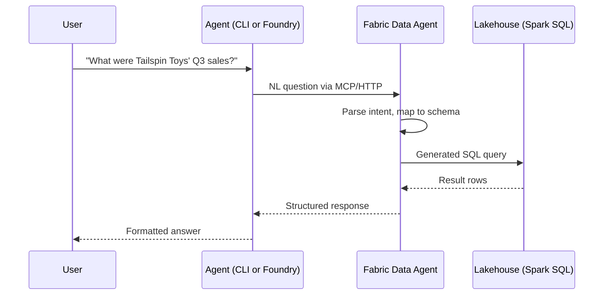

# Microsoft Fabric Data Agent

The Fabric Data Agent is one supported data backbone for this accelerator. It translates natural language questions into SQL queries against a [Fabric Lakehouse](https://learn.microsoft.com/fabric/data-engineering/lakehouse-overview), executes them, and returns structured results. If your data is in Databricks instead, use [Databricks Genie](./databricks-genie) and keep the same quota row contract.

## How it works



The Data Agent handles:
- **Schema grounding** — it knows your table names, column names, and relationships
- **NL→SQL translation** — converts questions to Spark SQL
- **Query execution** — runs the SQL against the Lakehouse
- **Result formatting** — returns structured data the agent can present

## Key concepts

### Lakehouse
A Fabric Lakehouse combines the flexibility of a data lake with the structure of a data warehouse. Tables are stored in Delta Lake format and queryable via Spark SQL.

This accelerator supports **two parallel data paths**, each backed by a separate Data Agent and Lakehouse:

| Path | Lakehouse | Tables | Use case |
|---|---|---|---|
| **WWI Sales Data** | sales lakehouse | 14 tables | Internal sales, customers, territories |
| **Market Data** | Market Data Lakehouse | 2 tables | SEC EDGAR company financials |

Both paths use the same technology stack — only the data and skills differ. See the `docs/data-paths.md` in the repo for the full comparison.

> 📖 [What is a Lakehouse?](https://learn.microsoft.com/fabric/data-engineering/lakehouse-overview) · [Delta Lake format](https://learn.microsoft.com/fabric/data-engineering/lakehouse-and-delta-tables)

### Data Agent configuration
The Data Agent is configured in the Fabric portal. You specify which Lakehouse tables it can access, add instructions for query generation (e.g., "fiscal year starts in July"), and optionally provide few-shot examples for complex queries.

Configuration for this accelerator lives in `fabric/` in the repo:
- `fabric/data-agent-instructions.md` — system prompt for query generation
- `fabric/few-shot-examples.json` — example question→SQL pairs

> 📖 [Create a Data Agent](https://learn.microsoft.com/en-us/fabric/data-science/how-to-create-data-agent) · [Data agent as MCP server](https://learn.microsoft.com/en-us/fabric/data-science/data-agent-mcp-server)

### MCP endpoint
The Data Agent exposes an HTTP endpoint compatible with the [Model Context Protocol](./mcp):

```
https://api.fabric.microsoft.com/v1/mcp/workspaces/{workspace-id}/dataagents/{data-agent-id}/agent
```

This is what the `sales-data` MCP server points to. In the Foundry surface, the same data source can be
wrapped as `FabricIQPreviewTool`, while the live eval harness calls the MCP endpoint directly with Entra auth.

> 📖 [Data Agent MCP server](https://learn.microsoft.com/en-us/fabric/data-science/data-agent-mcp-server) · [Fabric REST API](https://learn.microsoft.com/rest/api/fabric/)

## Authentication

The Data Agent uses Entra ID (Azure AD) authentication. Access is controlled at the Fabric workspace level:

- **CLI surface**: Interactive OAuth — you authenticate via browser on first use
- **Foundry surface**: Managed identity or OBO — the agent authenticates on your behalf

> 📖 [Fabric authentication](https://learn.microsoft.com/fabric/security/security-overview) · [Entra ID tokens](https://learn.microsoft.com/entra/identity-platform/access-tokens)

## Limitations

- **Query complexity** — very complex multi-join queries may not translate accurately. Few-shot examples help.
- **Latency** — first query after capacity resume can take 10-15 seconds (cold start). Subsequent queries are typically 1-3 seconds.
- **Schema changes** — if you modify Lakehouse tables, the Data Agent needs to re-index the schema.

## When to choose Fabric

Choose Fabric when the workshop owner wants a Microsoft-native path with MCP available directly from the Data
Agent. Choose Databricks when the customer already has curated Unity Catalog tables and Genie Spaces. Both
platforms feed [the same quota estimator](./quota-pipeline), so the report lab and Foundry publishing lab remain
identical after the data step.

## Live eval configuration

The golden-QA harness has two modes:

| Mode | Command | Meaning |
|---|---|---|
| Offline deterministic | `uv run python tests/eval/run_eval.py --mock --pass-rate 100` | Proves scoring, prompts, and workshop readiness without Fabric. |
| Live Fabric MCP | `uv run python tests/eval/run_eval.py --pass-rate 80` | Sends each question to your configured Fabric Data Agent MCP endpoint. |

For live mode, set either a full endpoint or workspace/agent IDs:

```dotenv
FABRIC_MCP_URL=https://api.fabric.microsoft.com/v1/mcp/workspaces/<workspace-id>/dataagents/<data-agent-id>/agent
# Or:
FABRIC_WORKSPACE_ID=<workspace-id>
FABRIC_DATA_AGENT_ID=<data-agent-id>

# Optional. If omitted, the harness calls tools/list and uses the only exposed tool.
FABRIC_MCP_TOOL_NAME=<tool-name>
```

If these values are missing, live eval exits before question 1 with a **blocked** configuration message. That is
intentional: it keeps "mock eval passed" separate from "live Fabric is configured and answering."

## Further reading

- [Fabric Data Agent overview](https://learn.microsoft.com/en-us/fabric/data-science/concept-data-agent)
- [Create a Fabric data agent](https://learn.microsoft.com/en-us/fabric/data-science/how-to-create-data-agent)
- [Fabric capacity pricing](https://learn.microsoft.com/fabric/enterprise/licenses)
- [Data agent as MCP server](https://learn.microsoft.com/en-us/fabric/data-science/data-agent-mcp-server)
