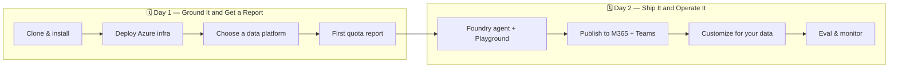

# Build an AI Agent That Does Real Work

Welcome. Over two hands-on days you will build an AI agent that connects to real business
data, understands your work context, and produces real deliverables — then ship that same
agent from a developer prototype to a production surface in Microsoft 365 Copilot and Teams.

This page is the **single entry point** for the workshop. Follow the links in order and you
will go from a fresh clone to a published, monitored agent.

:::tip The one-sentence version
Prototype in **GitHub Copilot CLI**, ground the agent in **Microsoft Fabric** or **Databricks**,
arm it with **tools and skills**, then publish through **Azure AI Foundry** to **M365 Copilot + Teams** —
all on the Wide World Importers sample dataset.
:::

## The two-day journey at a glance

Day 1 ends when you have generated your first quota report from real (or sample) sales data.
Day 2 takes that exact workflow and ships it to where business users actually work, then makes
it observable and customizable.

## Day 1 — Ground the agent and produce a report

Work through these in order. Each links to the page that walks you through it.

| Step | Do this | Page |
|---|---|---|
| 1. Set up your machine | Clone the repo, install dependencies with `uv sync --extra dev`, authenticate the CLI. | [Setup Guide](./workshop/setup) |
| 2. Understand the shape | See the two surfaces and how data flows end to end. | [System Overview](./architecture/system-overview) |
| 3. Deploy Azure infrastructure | Provision Foundry, storage, and Key Vault with Bicep. | [Setup Guide → Deploy](./workshop/setup) |
| 4. Choose a data platform | Pick **Microsoft Fabric** or **Databricks Genie** — the rest of the workflow is identical. | [Choose Your Data Platform](./building-blocks/choose-data-platform) |
| 5. Connect the data | Wire the Data Agent (Fabric) or Genie Space (Databricks) to the agent. | [Ground It in Data](./journey/ground-it-in-data) |
| 6. Run the CLI surface | Drive the agent from GitHub Copilot CLI over MCP. | [CLI Surface](./architecture/cli-surface) |
| 7. Generate your first report | Produce XLSX + HTML + PDF quota artifacts from a single prompt. | [Quota Estimation Pipeline](./building-blocks/quota-pipeline) |

**Day 1 done when:** `Generate a quota estimation report for Northwest territory` returns
XLSX, HTML, and PDF artifacts with citations.

## Day 2 — Ship it, customize it, operate it

| Step | Do this | Page |
|---|---|---|
| 8. Stand up the Foundry agent | Register the agent, see it in the portal, test it in the Playground. | [Foundry Surface](./architecture/foundry-surface) |
| 9. Compare agent patterns | Single agent with tools vs. a multi-agent pipeline — and when to use each. | [Foundry Surface → Multi-agent](./architecture/foundry-surface#multi-agent-pipeline-alternative) |
| 10. Publish to users | Publish the agent to M365 Copilot Chat and Teams. | [Ship It](./journey/ship-it) |
| 11. Add context and tools | Layer WorkIQ context, report tools, and reusable skills. | [Give It Context](./journey/give-it-context) · [Arm It with Tools](./journey/arm-it-with-tools) · [Build Reusable Skills](./journey/build-reusable-skills) |
| 12. Customize for your data | Swap in your own Lakehouse/Unity Catalog and golden queries. | [Choose Your Data Platform](./building-blocks/choose-data-platform) |
| 13. Evaluate and monitor | Inspect traces, watch for regressions, track cost. | [Foundry Surface → Portal](./architecture/foundry-surface#project-and-portal-experience) · [Costs](./workshop/costs) |

**Day 2 done when:** the same quota workflow runs as a registered Foundry agent, is testable
in the Playground, and you know exactly what to change to point it at your own data.

## Three ways to reach the same outcome

A theme of the workshop: the *same* business result — a cited quota report — can be produced
three ways. Compare them side by side as you go.

| Approach | Who it's for | Where it lives |
|---|---|---|
| **GitHub Copilot CLI** | Developers prototyping fast | [CLI Surface](./architecture/cli-surface) |
| **Single Foundry agent with tools** | The simple production path | [Foundry Surface](./architecture/foundry-surface) |
| **Multi-agent pipeline** | Advanced, observable, composable | [Foundry Surface → Multi-agent](./architecture/foundry-surface#multi-agent-pipeline-alternative) |

## Running this with a group?

If you are facilitating, start with the [Facilitator Guide](./workshop/facilitator-guide) for
pacing options (90-minute overview through full two-day delivery), demo-vs-hands-on guidance,
and golden prompts that keep the room synchronized. The [Demo Script](./workshop/demo-script)
gives a concrete customer scenario, and the [Costs](./workshop/costs) page shows what attendees
spend.

## Prerequisites

- A [Microsoft Fabric](https://learn.microsoft.com/fabric/get-started/fabric-trial) workspace **or** an
  [Azure Databricks](https://learn.microsoft.com/en-us/azure/databricks/) workspace with Unity Catalog
- An Azure subscription with permission to deploy into a resource group
- [GitHub Copilot CLI](https://docs.github.com/en/copilot/how-tos/copilot-cli/customize-copilot/add-mcp-servers) installed
- Python 3.11+ — we recommend [uv](https://docs.astral.sh/uv/) for environment management

Ready? **[Start with the Setup Guide →](./workshop/setup)**
