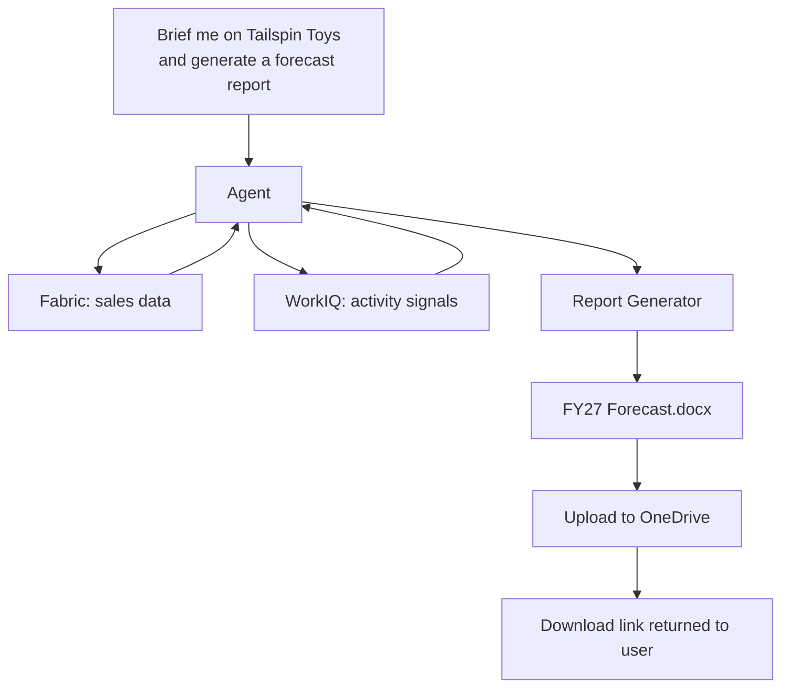

# Arm It with Tools

Your agent can query sales data and surface your recent activity with a customer. That's a solid briefing. But after reading that briefing, what do you do? You open Word, write up a forecast, paste in the numbers, format it, add a chart, save it to OneDrive, and send the link to your manager.

What if the agent just... did that?

In this chapter, you'll connect tools that produce real output — not just text in a chat window, but formatted reports, forecast calculations, and files uploaded to OneDrive.

## From answers to deliverables

The shift from "answering" to "producing" is what makes an agent feel like a coworker. A coworker doesn't just tell you the sales numbers — they draft the report so you can review it.



## What tools look like

In the [MCP protocol](../building-blocks/mcp), a "tool" is a function the agent can call. Tools have a name, a description (so the model knows when to use them), and input/output schemas. The agent doesn't need to be told *when* to use a tool — the orchestrator (Copilot CLI or Foundry) matches the user's intent to available tools automatically.

Some examples of tools in this accelerator:

| Tool | What it does | Surface |
|---|---|---|
| `wwi-sales-data` | Queries Lakehouse via Data Agent | CLI (MCP) |
| `workiq` | Retrieves M365 activity signals | CLI (MCP) |
| `quota-forecast` | Generates FY quota forecast from sales data | CLI (skill) |
| `FabricIQPreviewTool` | Same as wwi-sales-data, registered as Foundry tool | Foundry |
| `WorkIQPreviewTool` | Same as workiq, registered as Foundry tool | Foundry |
| Report generator function | Produces DOCX with charts, uploads to OneDrive | Foundry |

> 📖 **Learn more:** [MCP tool specification](https://modelcontextprotocol.io/docs/concepts/tools) · [Foundry tool types](https://learn.microsoft.com/azure/ai-foundry/concepts/agents-tools)

## Building a report generator

The report generator in this accelerator takes sales data and activity signals as input and produces a formatted DOCX with:

- **Quota forecast** — projections based on historical sales trends
- **Charts** — embedded visualizations of sales by category, trend lines
- **Citations** — every number traced back to the Lakehouse query that produced it
- **Activity summary** — recent engagement context from WorkIQ

The implementation lives in `src/agents/report_generator/`. It uses Python's `python-docx` library to build the document and the Microsoft Graph API to upload it to OneDrive.

### In the CLI surface

The CLI uses a **skill** — a prompt template that chains multiple tool calls and formats the output. The `quota-forecast` skill:

1. Calls `wwi-sales-data` to get historical sales
2. Runs a forecast calculation
3. Formats the result as inline markdown with tables and projections

```
copilot
> Based on Tailspin Toys' sales data, generate a quota forecast for FY27
```

> 📖 **Learn more:** [Copilot CLI skills](https://docs.github.com/copilot/github-copilot-in-the-cli/using-copilot-cli-skills) · [Creating custom skills](https://docs.github.com/copilot/github-copilot-in-the-cli/creating-custom-skills)

### In the Foundry surface

The Foundry agent uses a **custom function tool** that wraps the same report generation logic but adds OneDrive upload:

```
@WWISalesAgent Generate an FY27 quota forecast report for Tailspin Toys
```

The agent generates the DOCX, uploads it to the user's OneDrive, and returns a download link — all within M365 Copilot Chat.

> 📖 **Learn more:** [Azure AI Foundry function tools](https://learn.microsoft.com/azure/ai-foundry/how-to/agents/agents-function-calling) · [Microsoft Graph file upload](https://learn.microsoft.com/graph/api/driveitem-put-content)

## The citation requirement

Every number in a generated report needs a source. This isn't just good practice — it's what makes AI-generated reports trustworthy enough to send to a customer. The report generator includes:

- **Query attribution** — "Source: `SELECT SUM(amount) FROM sales WHERE customer = 'Tailspin Toys'`"
- **Timestamp** — when the data was queried
- **Confidence indicators** — where the model inferred vs. where it's reporting raw data

This is a design principle throughout the accelerator: citations are first-class, not an afterthought.

## Other tool patterns

Report generation is one example, but agents can connect to many kinds of tools:

- **Code execution** — run Python scripts, SQL queries, data transformations
- **Email drafting** — compose follow-up emails based on meeting notes
- **Calendar actions** — suggest meeting times, create calendar holds
- **File operations** — create, move, or share documents in SharePoint/OneDrive
- **API calls** — hit internal APIs, update CRM records, trigger workflows

The MCP protocol makes all of these discoverable and callable. Each tool is a capability the agent can reach for when the user's request calls for it.

## What you've accomplished

Your agent is now a full working system: it queries business data, incorporates your activity context, and produces real deliverables. But every time you want it to do this specific workflow — brief + forecast + report — you have to explain it from scratch. In the next chapter, you'll encapsulate this into a reusable skill.

**Next: [Build Reusable Skills →](./build-reusable-skills)**
