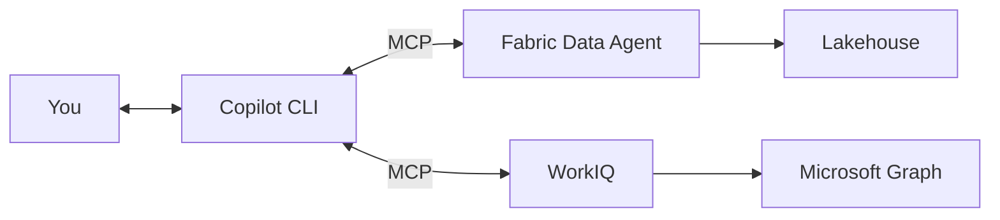

# Give It Context

Your agent can answer data questions now. Ask it about Tailspin Toys' sales and it'll query the Lakehouse and give you numbers. But ask it "What have I been working on with Tailspin Toys?" and it has nothing — because it can't see your email, your calendar, or your recent activity.

That's where [WorkIQ](../building-blocks/workiq) comes in. WorkIQ provides M365 activity signals — emails sent, meetings attended, files shared, engagement patterns — through a secure, scoped API. When you connect it to your agent, the agent's answers shift from *generic data lookups* to *personalized, context-aware briefings*.

## What changes with context

Without WorkIQ:
> "Tailspin Toys had $2.4M in Q3 sales across 3 product categories."

With WorkIQ:
> "Tailspin Toys had $2.4M in Q3 sales. You had 4 meetings with their procurement team in the last month, sent 12 emails, and they opened the pricing proposal you shared on June 2nd. Their engagement has been increasing."

Same data question, but now grounded in *your* working relationship with that customer.

## How it connects



The agent now has two MCP servers: one for business data (Fabric) and one for activity context (WorkIQ). The orchestrator — Copilot CLI — decides which to call based on your question. Ask about sales → Fabric. Ask about recent engagement → WorkIQ. Ask for a customer brief → both.

## Connecting WorkIQ

### In the CLI surface

WorkIQ is available as an MCP server for Copilot CLI:

```json
{
  "mcpServers": {
    "wwi-sales-data": {
      "type": "http",
      "url": "https://api.fabric.microsoft.com/v1/mcp/workspaces/YOUR-WORKSPACE-ID/dataagent"
    },
    "workiq": {
      "type": "npm",
      "package": "@anthropic-ai/workiq",
      "args": []
    }
  }
}
```

> ⚠️ **Demo tenant note:** In the current demo environment, WorkIQ uses mock M365 activity data. Production deployments use real OBO (on-behalf-of) authentication against Microsoft Graph. See [WorkIQ auth patterns](../building-blocks/workiq#authentication) for details.

### In the Foundry surface

In the Azure AI Foundry agent, WorkIQ is registered as a platform tool (`WorkIQPreviewTool`) that uses OBO authentication — the agent acts on behalf of the signed-in user to access their M365 data.

> 📖 **Learn more:** [WorkIQ overview](https://learn.microsoft.com/microsoft-365-copilot/extensibility/work-iq-overview) · [On-behalf-of auth flow](https://learn.microsoft.com/entra/identity-platform/v2-oauth2-on-behalf-of-flow)

## Try it

```
copilot
> What's my recent activity with Tailspin Toys?
```

The agent calls WorkIQ and returns a summary of your emails, meetings, and file-sharing activity with that customer.

Now combine both:

```
copilot
> Brief me on Tailspin Toys — sales performance and recent engagement.
```

The agent calls *both* MCP servers and synthesizes a combined briefing. This is the first time the agent feels like a coworker rather than a database query tool — it knows both the numbers *and* the relationship.

## The auth difference matters

One detail worth understanding: the Data Agent and WorkIQ use different auth models, and this matters for how the agent operates in production.

| | Data Agent (Fabric) | WorkIQ (M365) |
|---|---|---|
| **What it accesses** | Lakehouse tables (shared data) | Your emails, meetings, files (personal data) |
| **Auth model** | Service principal or user token | OBO — acts as *you* |
| **Scope** | Workspace-level | User-level |
| **Implication** | Same data for everyone | Different results per user |

WorkIQ's OBO model is critical: the agent can only see *your* activity, not anyone else's. This is a privacy boundary enforced by Microsoft Graph.

> 📖 **Learn more:** [Microsoft Graph permissions model](https://learn.microsoft.com/graph/permissions-overview) · [Fabric workspace security](https://learn.microsoft.com/fabric/security/permission-model)

## What you've accomplished

Your agent now has two sources of intelligence: business data from Fabric and activity context from WorkIQ. But it still only *tells* you things. In the next chapter, you'll connect tools that let it *produce* — reports, documents, and real deliverables.

**Next: [Arm It with Tools →](./arm-it-with-tools)**
