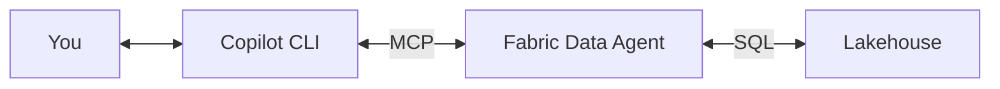

# Ground It in Data

The first thing that separates a useful agent from a chatbot is access to real data. A chatbot can tell you what "sales forecasting" means in general. An agent connected to your Lakehouse can tell you that Tailspin Toys' Q3 sales were $2.4M, up 12% from Q2, driven by novelty gift items.

In this chapter, you'll connect your agent to a [Microsoft Fabric Data Agent](../building-blocks/fabric-data-agent) — a service that translates natural language questions into SQL queries against your Lakehouse tables.

## What you're building



The chain is: you ask a question → the agent routes it to the [Fabric Data Agent](../building-blocks/fabric-data-agent) over [MCP](../building-blocks/mcp) → the Data Agent translates your question to SQL → the Lakehouse returns results → the answer flows back to you.

## The data

This accelerator supports **multiple data paths**, each backed by its own Fabric Data Agent and Lakehouse:

- **WWI Sales Data** — [Wide World Importers](../building-blocks/wwi-dataset) simulates a wholesale company with customers, orders, products, and territories. It's the primary demo dataset.
- **Market Data** — SEC EDGAR filings provide real-world company financials for competitive intelligence and market research.

Each data path gets its own Data Agent with tailored instructions and few-shot examples. You can also [bring your own data](../building-blocks/wwi-dataset#customizing-for-your-scenario).

## Connecting the Data Agent

### Option A: Workspace MCP config (recommended)

The repo includes a `.github/mcp.json` file that Copilot CLI auto-discovers. Set your Fabric workspace ID:

```json
{
  "mcpServers": {
    "wwi-sales-data": {
      "type": "http",
      "url": "https://api.fabric.microsoft.com/v1/mcp/workspaces/YOUR-WORKSPACE-ID/dataagent"
    }
  }
}
```

> 📖 **Learn more:** [Fabric Data Agent MCP endpoint](https://learn.microsoft.com/fabric/data-engineering/data-agent-mcp) · [MCP server configuration in Copilot CLI](https://docs.github.com/copilot/github-copilot-in-the-cli/using-mcp-servers-with-copilot-cli)

### Option B: CLI one-liner

```bash
copilot mcp add --transport http wwi-sales-data \
  "https://api.fabric.microsoft.com/v1/mcp/workspaces/YOUR-WORKSPACE-ID/dataagent"
```

### Try it

Once connected, start Copilot CLI and ask a data question:

```
copilot
> What were Tailspin Toys' total sales by product category for the last 12 months?
```

The agent calls the `wwi-sales-data` MCP server, which hits the Data Agent, which translates your question to SQL, queries the Lakehouse, and returns a table. No SQL writing required.

### What's happening under the hood

The Fabric Data Agent does the heavy lifting here. It:

1. **Parses your natural language question** using a language model
2. **Maps it to your Lakehouse schema** — it knows your table and column names
3. **Generates SQL** appropriate for Spark SQL (Fabric's query engine)
4. **Executes the query** against the Lakehouse
5. **Returns structured results** that the agent can format for you

This is called NL→SQL (natural language to SQL). The Data Agent handles schema grounding, query generation, and execution — your MCP server is just the HTTP bridge.

> 📖 **Learn more:** [How Fabric Data Agent works](https://learn.microsoft.com/fabric/data-engineering/data-agent-concept) · [NL→SQL in Fabric](https://learn.microsoft.com/fabric/data-engineering/data-agent-faq)

## What you've accomplished

Your agent can now answer questions about real business data. But notice what it *can't* do yet — it doesn't know anything about your recent activity with that customer. It doesn't know you emailed them yesterday or had a meeting on Tuesday. That context comes next.

**Next: [Give It Context →](./give-it-context)**
