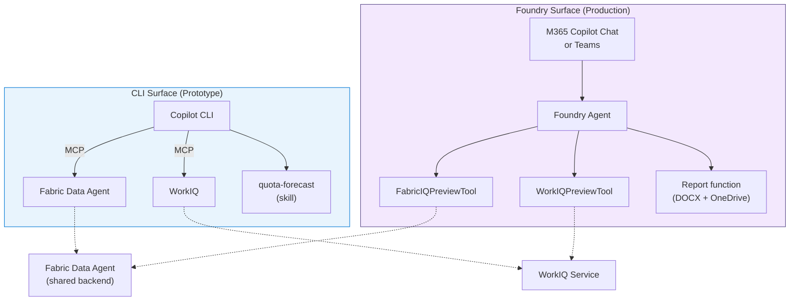

# Ship It

You've built an agent that queries data, understands your context, produces deliverables, and encapsulates workflows into reusable skills. It works great in the CLI. But the people who need this most — account executives, sales managers, customer success leads — don't live in a terminal. They live in Teams, Outlook, and M365 Copilot Chat.

This chapter covers how the same agent capabilities move from a developer prototype to an enterprise-ready application.

## Two surfaces, one backend

The core idea of this accelerator: you prototype in one surface and deploy to another, without rewriting your backend logic.



The left side is what you've been building. The right side is where it's going. The dotted lines show that both surfaces hit the *same* backend services.

## The translation

Each CLI concept has a Foundry equivalent:

| CLI Concept | Foundry Equivalent | Notes |
|---|---|---|
| MCP server | Platform tool or function tool | Same HTTP endpoint, different registration |
| Skill (prompt template) | Agent system prompt + tool selection | Skills inform the agent's instructions |
| Copilot CLI orchestrator | Foundry Responses API | Both do intent routing + tool calling |
| Interactive OAuth | OBO (on-behalf-of) | Foundry acts as the user via Entra |
| Inline markdown output | Adaptive Card + DOCX link | Richer formatting in Teams |

> 📖 **Learn more:** [Azure AI Foundry Agent Service](https://learn.microsoft.com/azure/ai-foundry/concepts/agents) · [Foundry Responses API](https://learn.microsoft.com/azure/ai-foundry/how-to/agents/agents-responses) · [M365 Copilot extensibility](https://learn.microsoft.com/microsoft-365-copilot/extensibility/)

## Setting up the Foundry surface

### 1. Create a Foundry agent

In Azure AI Foundry, create a new agent and register your tools:

- **FabricIQPreviewTool** — wraps the same Data Agent MCP endpoint you used in CLI
- **WorkIQPreviewTool** — wraps WorkIQ with OBO authentication
- **Custom function** — report generation + OneDrive upload

The agent's system prompt encodes the same logic your skills defined: when asked for a customer brief, call both data and context tools, then format the response.

> 📖 **Learn more:** [Creating Foundry agents](https://learn.microsoft.com/azure/ai-foundry/how-to/agents/agents-create) · [Registering tools](https://learn.microsoft.com/azure/ai-foundry/how-to/agents/agents-tools)

### 2. Publish as an Agent Application

Once the agent works in the Foundry playground, publish it as an Agent Application:

- **Entra identity** — the agent gets its own app registration
- **RBAC** — control who can use it
- **Stable endpoint** — accessible from M365 Copilot and Teams

> 📖 **Learn more:** [Publishing agent applications](https://learn.microsoft.com/azure/ai-foundry/how-to/agents/agents-publish) · [Entra app registration](https://learn.microsoft.com/entra/identity-platform/quickstart-register-app)

### 3. Use it in M365

Business users @mention the agent in M365 Copilot Chat or Teams:

```
@WWISalesAgent Brief me on Tailspin Toys — what's our recent engagement and sales activity?
```

```
@WWISalesAgent Generate an FY27 quota forecast report for Tailspin Toys
```

The agent responds inline (with data tables and summaries) and can attach generated DOCX reports as OneDrive links.

## Other surfaces

This accelerator supports five architecture options for exposing the agent to end users:

| Surface | How it works | Status |
|---|---|---|
| **Copilot CLI** | MCP servers + skills in your terminal | ✅ Implemented |
| **M365 Direct Publish** | Zero-code — publish from Fabric portal into M365 Copilot Chat | ✅ Implemented |
| **Foundry Prompt Agent** | Declarative agent with FunctionTools for forecasting, research, and reports | ✅ Implemented |
| **Foundry Hosted Agent** | Bring-your-own-code container with Fabric MCP, quota, research, attainment, activity, and report tools | ✅ Implemented |
| **Cowork** | M365 plugin surface with native WorkIQ access | 📋 Documented |

The backend services (Fabric Data Agent, WorkIQ, report generator) don't change. Only the surface does.

> 📖 **Learn more:** [Copilot Studio agents](https://learn.microsoft.com/microsoft-copilot-studio/fundamentals-what-is-copilot-studio) · [Teams AI library](https://learn.microsoft.com/microsoftteams/platform/bots/how-to/teams-conversational-ai/teams-conversation-ai-overview) · [Foundry Hosted Agents](https://learn.microsoft.com/azure/ai-foundry/how-to/agents/agents-hosted)

## What you've accomplished

You started with a chatbot. You connected it to real data, gave it your working context, armed it with tools that produce deliverables, composed those into reusable skills, and shipped it to where business users actually work. That's the full journey from chat to working agent.

### Recap

| Chapter | What you added | Result |
|---|---|---|
| [Ground It in Data](./ground-it-in-data) | Fabric Data Agent | Agent answers questions about real sales data |
| [Give It Context](./give-it-context) | WorkIQ | Agent knows your recent activity with customers |
| [Arm It with Tools](./arm-it-with-tools) | Report generator | Agent produces formatted reports and files |
| [Build Reusable Skills](./build-reusable-skills) | Skill templates | Workflows are repeatable and shareable |
| [Ship It](./ship-it) | Foundry → M365 | Business users access it in Teams and Copilot Chat |

### Where to go from here

- **[Architecture](../architecture/system-overview)** — deep-dive on how all the pieces connect
- **[Building Blocks](../building-blocks/fabric-data-agent)** — reference docs for each component
- **[Workshop Guide](../workshop/facilitator-guide)** — how to run this as a workshop for your team
