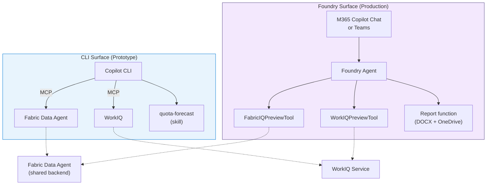

# Ship It

:::info[Where you are · 🗓️ Day 2]

Shipping is the **Day 2** payoff: the agent you grounded and tested on Day 1 now reaches
business users in Teams and M365 Copilot Chat. See the [Workshop Overview](../intro) for the
full Day 1 → Day 2 path.
:::

You've built an agent that queries data, understands your context, produces deliverables, and encapsulates workflows into reusable skills. It works great in the CLI. But the people who need this most — account executives, sales managers, customer success leads — don't live in a terminal. They live in Teams, Outlook, and M365 Copilot Chat.

This chapter covers how the same agent capabilities move from a developer prototype to an enterprise-ready application.

## Two surfaces, one backend

The core idea of this accelerator: you prototype in one surface and deploy to another, without rewriting your backend logic.



The left side is what you've been building. The right side is where it's going. The dotted lines show that both surfaces hit the *same* backend services.

## The translation

Each CLI concept has a Foundry equivalent:

| CLI Concept | Foundry Equivalent | Notes |
|---|---|---|
| MCP server | Platform tool or function tool | Same HTTP endpoint, different registration |
| Skill (prompt template) | Agent system prompt + tool selection | Skills inform the agent's instructions |
| Copilot CLI orchestrator | Foundry Responses API | Both do intent routing + tool calling |
| Interactive OAuth | OBO (on-behalf-of) | Foundry acts as the user via Entra |
| Inline markdown output | Adaptive Card + DOCX link | Richer formatting in Teams |

> 📖 **Learn more:** [Microsoft Foundry Agent Service](https://learn.microsoft.com/en-us/azure/foundry/agents/overview) · [Microsoft Foundry SDKs and endpoints](https://learn.microsoft.com/en-us/azure/foundry/how-to/develop/sdk-overview) · [M365 Copilot extensibility](https://learn.microsoft.com/microsoft-365-copilot/extensibility/)

## Setting up the Foundry surface

### 1. Create a Foundry agent

In Azure AI Foundry, create a new agent and register your tools:

- **FabricIQPreviewTool** — wraps the same Data Agent MCP endpoint you used in CLI (requires a Fabric IQ
  connection). When no connection is configured, the agent registers a demo-safe `fabric_query` function
  tool instead, so it runs end-to-end on day one — see [Foundry Surface](../architecture/foundry-surface).
- **WorkIQPreviewTool** — wraps WorkIQ with OBO authentication
- **Custom function** — report generation + OneDrive upload

Register and verify the live agent with `uv run python scripts/verify_foundry_agent.py` (it registers
`WWISalesAgent`, confirms it is listed in the project, and runs one Playground-style query).

The agent's system prompt encodes the same logic your skills defined: when asked for a customer brief, call both data and context tools, then format the response.

> 📖 **Learn more:** [Microsoft Foundry Agent Service](https://learn.microsoft.com/en-us/azure/foundry/agents/overview) · [Function calling](https://learn.microsoft.com/en-us/azure/foundry/agents/how-to/tools/function-calling)

### 1b. Compare single-agent and multi-agent pipelines

Before publishing, run both production patterns and compare their traces:

| Pattern | Command or portal action | Choose it when |
|---|---|---|
| Single agent with multiple tools | Test `WWISalesAgent` in Foundry playground. | You want the simplest production path. |
| Multi-agent pipeline | `uv run python -m src.orchestrator.multi_agent "Generate a quota report for Tailspin Toys" --customer "Tailspin Toys"` | You want separate planner/data/research/context/report ownership and observability. |

Both patterns must produce the same XLSX/HTML/PDF quota artifacts so attendees compare architecture trade-offs,
not business-output differences.

### 1c. Build and verify the hosted agent container

The **Foundry Hosted Agent** is a bring-your-own-code container. Build it and smoke-test the probes and
invocation locally before deploying to managed compute:

```powershell
# Build
docker build -f src/orchestrator/hosted_agent/Dockerfile -t wwi-hosted-agent .

# Run and probe
docker run -d --name wwi-agent -p 8080:8088 wwi-hosted-agent
curl http://127.0.0.1:8080/healthz   # -> {"status": "alive"}
curl http://127.0.0.1:8080/readyz    # -> {"status": "ready", "adapter": "local-runtime"}
curl http://127.0.0.1:8080/readiness # -> {"status": "ready", "adapter": "local-runtime"}

# Invoke custom automation (LocalDeterministicAdapter answers without Azure creds)
curl -X POST http://127.0.0.1:8080/invoke -H "Content-Type: application/json" `
  -d '{"input":"Generate a base quota estimation report for Wide World Importers"}'
# -> {"output": "Generated a quota estimation report ... Artifacts: { xlsx, html, pdf }"}

# Invoke the Hosted Agents Responses protocol used by Foundry/M365
curl -X POST http://127.0.0.1:8080/responses -H "Content-Type: application/json" `
  -d '{"input":"Generate a base quota estimation report for Wide World Importers","model":"gpt-4o"}'
# -> {"object":"response","status":"completed","output_text":"Generated ..."}

docker rm -f wwi-agent
```

`/healthz` is the liveness probe and `/readyz` plus `/readiness` are readiness probes; wire them into your managed
compute health checks. The container responds to both `/responses` (conversational Hosted Agent protocol)
and `/invoke` (custom automation protocol) even without Azure credentials because it falls back to a local
deterministic adapter — set the Azure environment variables to route through a real model instead.

### 2. Publish to Microsoft 365

Once the agent works in the Foundry playground, use the current Foundry **Publish** flow to make the registered agent available in Microsoft 365 Copilot and Teams:

- **Entra identity** — the agent gets its own app registration
- **RBAC** — control who can use it
- **Stable endpoint** — accessible from M365 Copilot and Teams

Use this checklist for the facilitator handoff:

| Step | Command or portal action | Proof |
|---|---|---|
| Register Bot Service provider | `az provider register --namespace Microsoft.BotService` then `az provider show --namespace Microsoft.BotService --query registrationState -o tsv` | State is `Registered`. |
| Verify prompt agent in Foundry | Run `uv run python scripts/verify_foundry_agent.py`, then open **Agents > WWISalesAgent > Playground**. | CLI prints `[OK] live registration + Playground response verified`; Playground returns an answer. |
| Deploy hosted agent | Build/push the hosted container and deploy `src/orchestrator/hosted_agent/agent.yaml` so `WWISalesHostedAgent` exposes `responses` and `invocations`. | Foundry shows a hosted agent endpoint and a dedicated agent identity. |
| Publish | In Foundry, choose **Publish** and select Microsoft 365 Copilot / Teams. | The hosted Responses endpoint is published with an Entra identity and assignment surface. |
| Assign users/groups | Add the workshop pilot group or test users to the application assignment/RBAC surface. | The same user who will demo can see the agent. |
| Reassign data RBAC | Grant the agent identity the minimum Fabric workspace/Data Agent, Databricks, storage, and Graph permissions required for its tools. | The agent, not just the facilitator, can query data and write artifacts. |
| Test business surface | In Teams or M365 Copilot Chat, @mention the agent with the Tailspin Toys prompt. | The published agent responds; if not, use Foundry Playground as the fallback surface. |

:::warning[Publish preflight — read before you click Publish]

- **Select the active version.** Publishing targets a specific agent version. Confirm the
  version you verified (`[register] created WWISalesAgent version N`) is set active before publishing,
  or the business surface may serve a stale definition.
- **Choose the right scope.** **"Just you"** is the no-admin demo path — pick it for the workshop so you
  don't wait on a tenant admin. **Organization** scope requires admin approval and can block the demo.
- **Reassign downstream RBAC to the *agent* identity, not yours.** The published agent gets its own Entra
  identity; the facilitator's permissions do not carry over. Grant the agent identity the Fabric / Databricks /
  storage / Graph access its tools need, or live calls fail even though the Playground worked.
- **Published-surface limitations.** Published M365/Teams agents **do not support response streaming or inline
  citations** today — answers arrive as a single block. Keep the Foundry Playground as the demo fallback when you
  want to show traces and citations.
:::

> 📖 **Learn more:** [Publish agents to Microsoft 365 Copilot and Teams](https://learn.microsoft.com/en-us/azure/foundry/agents/how-to/publish-copilot) · [Agent identity](https://learn.microsoft.com/en-us/azure/foundry/agents/concepts/agent-identity) · [Entra app registration](https://learn.microsoft.com/entra/identity-platform/quickstart-register-app)

### 3. Use it in M365

Business users @mention the agent in M365 Copilot Chat or Teams:

```
@WWISalesAgent Brief me on Tailspin Toys — what's our recent engagement and sales activity?
```

```
@WWISalesAgent Generate an FY27 quota forecast report for Tailspin Toys
```

The agent responds inline (with data tables and summaries) and can attach generated DOCX reports as OneDrive links.

### 4. Monitor and evaluate

Open Foundry tracing after each playground run. For the workshop, point out:

- Which tools or specialist agents ran.
- The data source citation: Fabric Data Agent or Databricks Genie / Unity Catalog.
- The generated artifact metadata rather than sensitive file contents.
- Failures that should become eval cases before production rollout.

> 📖 **Learn more:** [Set up tracing for AI agents](https://learn.microsoft.com/en-us/azure/foundry/observability/how-to/trace-agent-setup)

### Live-smoke automation

The repository includes `.github/workflows/live-smoke.yml` for scheduled and manual drift checks. It runs five
independent proofs:

| Job | What it proves | Missing config behavior |
|---|---|---|
| Foundry registration | `WWISalesAgent` can register and answer in the configured project. | Reports blocked when Azure/Foundry secrets are absent. |
| Fabric live eval | Golden-QA questions reach the Fabric Data Agent MCP endpoint. | Reports blocked when Fabric MCP or Azure auth values are absent. |
| Databricks Genie | The Genie SDK adapter returns normalized rows. | Reports blocked when workspace/space values are absent. |
| Published site | The GitHub Pages workshop site is reachable and docs links resolve. | Always runs; failures indicate a public docs issue. |
| Demo readiness | Mock eval and `demo_check.py` still pass. | Always runs; failures indicate an offline regression. |

Manual runs default to demo mode, where missing live secrets are recorded as blocked in the uploaded
`demo-readiness-report.json` artifact. Use required mode before a customer delivery:

```powershell
gh workflow run live-smoke.yml -f require_live_backends=true
```

In required mode, Foundry, Fabric, and Databricks live backend skips fail the workflow so a green run means those
configured integrations actually ran.

## Other surfaces

This accelerator supports five architecture options for exposing the agent to end users:

| Surface | How it works | Status |
|---|---|---|
| **Copilot CLI** | MCP servers + skills in your terminal | ✅ Implemented |
| **M365 Direct Publish** | Zero-code — publish from Fabric portal into M365 Copilot Chat | ✅ Implemented |
| **Foundry Prompt Agent** | Declarative agent with FunctionTools for forecasting, research, and reports | ✅ Implemented |
| **Foundry Hosted Agent** | Bring-your-own-code container with Fabric MCP, quota, research, attainment, activity, and report tools | ✅ Implemented |
| **Cowork** | M365 plugin surface with native WorkIQ access | 📋 Documented |

The backend services (Fabric Data Agent, WorkIQ, report generator) don't change. Only the surface does.

> 📖 **Learn more:** [Copilot Studio agents](https://learn.microsoft.com/microsoft-copilot-studio/fundamentals-what-is-copilot-studio) · [Teams AI library](https://learn.microsoft.com/microsoftteams/platform/bots/how-to/teams-conversational-ai/teams-conversation-ai-overview) · [Microsoft Foundry Agent Service](https://learn.microsoft.com/en-us/azure/foundry/agents/overview)

## What you've accomplished

You started with a chatbot. You connected it to real data, gave it your working context, armed it with tools that produce deliverables, composed those into reusable skills, and shipped it to where business users actually work. That's the full journey from chat to working agent.

### Recap

| Chapter | What you added | Result |
|---|---|---|
| [Ground It in Data](./ground-it-in-data) | Fabric Data Agent | Agent answers questions about real sales data |
| [Give It Context](./give-it-context) | WorkIQ | Agent knows your recent activity with customers |
| [Arm It with Tools](./arm-it-with-tools) | Report generator | Agent produces formatted reports and files |
| [Build Reusable Skills](./build-reusable-skills) | Skill templates | Workflows are repeatable and shareable |
| [Ship It](./ship-it) | Foundry → M365 | Business users access it in Teams and Copilot Chat |

### Where to go from here

- **[Architecture](../architecture/system-overview)** — deep-dive on how all the pieces connect
- **[Building Blocks](../building-blocks/fabric-data-agent)** — reference docs for each component
- **[Workshop Guide](../workshop/facilitator-guide)** — how to run this as a workshop for your team
